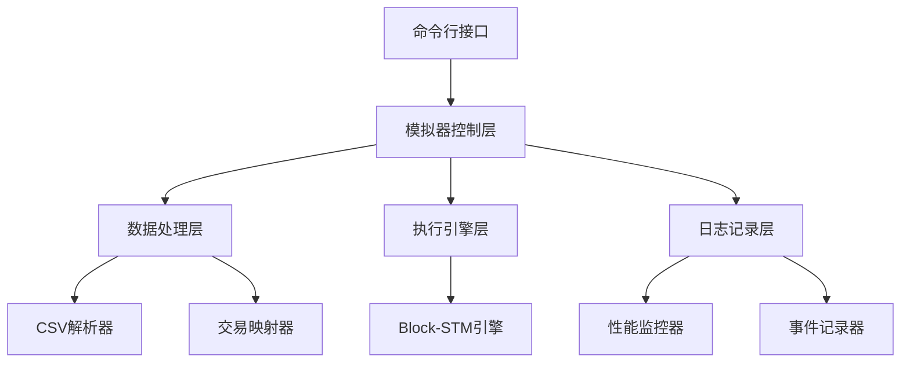
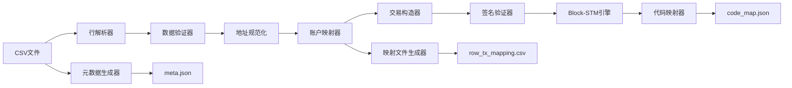
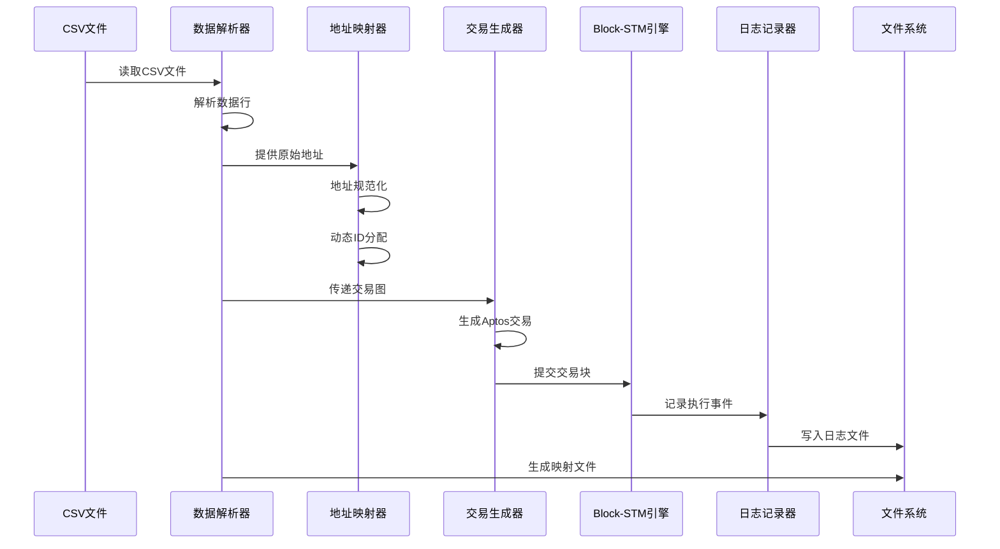
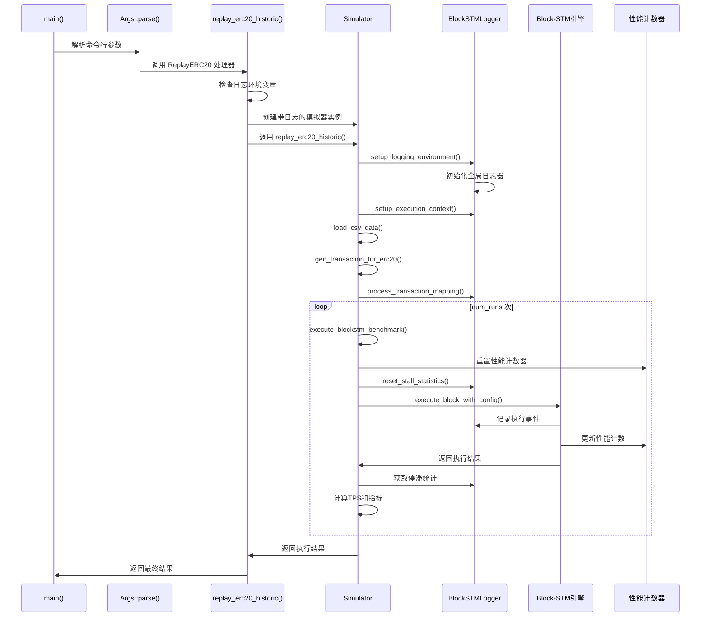

# 交易重放模拟器与日志系统设计实现

## 文档信息

- **创建时间**: 2025-08-22 14:30
- **文档版本**: v1.0
- **目标读者**: Block-STM开发者、性能测试工程师
- **依赖版本**: Aptos Core v1.8+

## 概览

本文档深入解析Aptos Block-STM交易重放模拟器与日志系统的设计实现，包括CSV历史数据处理、并行执行模拟、性能监控和日志记录系统。通过详细的源码分析和函数调用链追踪，为开发者提供完整的技术实现指南。

## 目录

1. [系统设计理念与架构](#第一章系统设计理念与架构)
2. [核心组件实现详解](#第二章核心组件实现详解)
3. [函数调用链深度追踪](#第三章函数调用链深度追踪)
4. [性能统计与监控系统](#第四章性能统计与监控系统)

---

## 第一章：系统设计理念与架构

### 1.1 模拟器架构设计思路

Aptos Block-STM 交易重放模拟器的设计核心理念是**真实性、可控性与可观测性**。该系统通过重放以太坊历史交易数据来评估 Block-STM 并行执行引擎的性能表现，为并行区块链系统提供全面的基准测试能力。

#### 架构设计原则

**1. 历史数据驱动的真实性**

传统的基准测试往往依赖合成数据，难以反映真实区块链环境中的复杂交互模式。本模拟器直接使用以太坊历史交易数据，确保测试场景的真实性：

- **真实交易模式**: 保持原有的账户交互关系和交易依赖
- **真实负载分布**: 反映实际网络中的交易密度变化
- **真实冲突模式**: 保留原始的读写冲突特征

**2. 模块化的可扩展架构**

模拟器采用分层模块化设计，核心组件职责明确且相互解耦：



**3. 零侵入的日志集成**

日志系统设计遵循"零性能影响"原则，通过环境变量控制启用状态，支持运行时动态配置：

```rust
// simulator.rs:187-195
pub fn new_with_logging(
    num_accounts: usize,
    enable_logging: bool,
    log_output_dir: Option<String>,
    concurrency_level: u32,
) -> Self {
    // 日志系统只在显式启用时初始化
    // 避免对基准测试性能造成影响
}
```

#### 核心架构组件

**模拟器控制器 (Simulator)**

位置: `src/simulator.rs:84-100`

```rust
pub struct Simulator{
    account_universe: AccountUniverse,        // 账户宇宙，管理测试账户
    executor: FakeExecutor,                   // 假执行器，用于状态管理
    _logger: Option<Arc<BlockSTMLogger>>,     // Block-STM日志记录器
    log_enabled: bool,                        // 是否启用日志记录
    csv_data: Option<Vec<TransactionData>>,   // 从CSV加载的交易数据
    current_block_id: u64,                    // 当前区块ID
    log_output_dir: Option<String>,           // 日志输出目录
    concurrency_level: u32,                   // 并发执行级别
}
```

**数据流转架构**

系统采用管道式数据处理架构，确保数据的一致性转换：

```
CSV文件 → TransactionData → AccountUniverse → SignedTransaction → Block-STM执行 → 性能指标
         ↓                   ↓                 ↓                   ↓
      映射记录           账户状态           交易验证            日志事件
```

### 1.2 日志收集器设计模式

#### 全局单例日志器模式

Block-STM日志系统采用全局单例模式，确保整个执行过程中日志记录的一致性和线程安全性。日志器通过环境变量配置，支持动态启用和配置调整。

**初始化机制**

```rust
// simulator.rs:237-260
pub fn setup_logging_environment(&mut self) -> Result<(), String> {
    if !self.log_enabled {
        return Ok(());
    }

    let config = if let Some(ref log_dir) = self.log_output_dir {
        LoggingConfig {
            enabled: true,
            log_dir: std::path::PathBuf::from(log_dir),
            log_level: LogLevel::Debug,
            max_file_size: 100 * 1024 * 1024, // 100MB
            buffer_size: 10000,
            async_logging: true,
            include_read_write_details: true,
        }
    } else {
        LoggingConfig::default()
    };
    
    init_global_logger(config)
        .map_err(|e| format!("Failed to initialize logger: {:?}", e))?;
    
    println!("Block-STM logger initialized with output dir: {:?}", 
            self.log_output_dir);
    Ok(())
}
```

#### 事件驱动的日志架构

日志系统基于事件驱动模型，将Block-STM执行过程中的关键事件分类记录：

**核心事件类型**

1. **执行事件**: 交易开始、执行完成、验证开始、验证结束
2. **状态事件**: 任务状态转换、调度决策、依赖关系变化
3. **性能事件**: TPS计算、资源使用情况、停滞时间统计
4. **错误事件**: 中止事件、重执行触发、验证失败

**多文件并行写入**

日志系统根据事件类型将日志分散写入多个专门的NDJSON文件，避免单文件写入瓶颈：

- `block_summary.ndjson`: 区块级汇总信息和内存使用快照
- `scheduler_states.ndjson`: 调度器状态转换和任务管理事件
- `mvhashmap_ops.ndjson`: MV哈希表操作记录（读写、估值标记等）
- `dependencies.ndjson`: 依赖关系阻塞和解除事件
- `execution_flow.ndjson`: 交易执行和验证流程事件
- `abort_recovery.ndjson`: 中止和重执行恢复事件
- `detailed_operations.ndjson`: 聚合器和延迟字段等详细操作
- `system_operations.ndjson`: 模块缓存和性能指标等系统操作
- `stall_events.ndjson`: 通用停滞事件记录
- `transaction_stalls.ndjson`: 交易级停滞事件
- `system_stalls.ndjson`: 系统级停滞事件

#### 上下文感知的日志记录

**执行上下文设置**

```rust
// simulator.rs:272-295
pub fn setup_execution_context(&self, data_path: &str) {
    use aptos_block_executor::block_stm_logger::{get_global_logger, ExecutionContext};
    
    if let Some(logger) = get_global_logger() {
        let dataset = if data_path.contains("ETH") {
            "ETH"
        } else if data_path.contains("USDT") {
            "USDT"  
        } else {
            "UNKNOWN"
        }.to_string();

        let context = ExecutionContext {
            dataset,
            source_csv: data_path.to_string(),
            sample_period_ms: std::env::var("SAMPLE_PERIOD_MS")
                .unwrap_or_else(|_| "50".to_string())
                .parse::<u32>()
                .unwrap_or(50),
            read_sample_rate: std::env::var("READ_SAMPLE_RATE")
                .unwrap_or_else(|_| "0.01".to_string())
                .parse::<f64>()
                .unwrap_or(0.01),
        };

        logger.set_execution_context(context);
    }
}
```

### 1.3 CSV历史数据重放机制

#### 数据处理管道设计

历史数据重放机制是整个模拟器的核心功能，通过完整的数据处理管道将CSV格式的历史交易数据转换为Block-STM可执行的交易格式。

**完整数据流**



**CSV数据解析与转换**

系统支持标准的CSV格式，自动识别字段结构并进行数据清洗：

```rust
// simulator.rs:306-350
pub fn load_csv_data(&mut self, csv_path: &str) -> Result<Vec<(usize, usize)>, Box<dyn std::error::Error>> {
    println!("Loading CSV data from: {}", csv_path);
    
    let file = File::open(csv_path)?;
    let reader = BufReader::new(file);
    let mut transaction_graph = Vec::new();
    let mut csv_data = Vec::new();
    let mut account_id_map = HashMap::new();
    let mut next_account_id = 1u64;
    
    // 解析CSV文件（跳过标题行）
    for (line_num, line) in reader.lines().enumerate() {
        if line_num == 0 { continue; } // 跳过标题行
        let line = line?;
        let parts: Vec<&str> = line.split(',').collect();
        if parts.len() >= 3 {
            if let (Ok(from), Ok(to)) = (parts[0].parse::<usize>(), parts[1].parse::<usize>()) {
                transaction_graph.push((from, to));
                
                // 地址规范化处理
                let from_norm = from_raw.trim().to_lowercase();
                let to_norm = to_raw.trim().to_lowercase();
                
                // 动态分配account_id
                let _from_account_id = *account_id_map.entry(from_norm.clone()).or_insert_with(|| {
                    let id = next_account_id;
                    next_account_id += 1;
                    id
                });
                // ...
            }
        }
    }
    
    Ok(transaction_graph)
}
```

#### 地址映射与规范化

**地址规范化处理**

为确保地址一致性，系统对所有地址进行标准化处理：

1. **大小写规范化**: 转换为小写字母
2. **空格清理**: 删除前后空白字符
3. **格式验证**: 检查地址格式合法性
4. **重复去除**: 建立唯一地址到ID的映射

**动态账户ID分配**

```rust
// simulator.rs:330-340
let _from_account_id = *account_id_map.entry(from_norm.clone()).or_insert_with(|| {
    let id = next_account_id;
    next_account_id += 1;
    id
});
let _to_account_id = *account_id_map.entry(to_norm.clone()).or_insert_with(|| {
    let id = next_account_id;
    next_account_id += 1;
    id
});
```

#### 交易映射追踪系统

**映射文件生成**

系统为每个执行的区块生成详细的映射文件，记录CSV行号与Block-STM交易索引的对应关系：

```rust
// simulator.rs:369-420
fn generate_row_tx_mapping(
    &self, 
    csv_path: &str, 
    csv_data: &[TransactionData],
    account_id_map: &HashMap<String, u64>
) -> Result<(), Box<dyn std::error::Error>> {
    let log_dir = self.log_output_dir.as_ref().unwrap_or(&default_log_dir);
    let block_dir = format!("{}/block_{:03}", log_dir, self.current_block_id);
    std::fs::create_dir_all(&block_dir)?;
    
    let mapping_path = format!("{}/row_tx_mapping.csv", block_dir);
    let mut mapping_file = File::create(&mapping_path)?;
    
    // CSV头部字段
    writeln!(mapping_file, "block_id,dataset,source_csv,row_number,tx_index,from_raw,to_raw,value_raw,from_norm,to_norm,from_account_id,to_account_id,key_from_id,key_to_id,included,skip_reason,row_hash")?;
    
    // 为每个交易写入映射记录
    for (idx, transaction_data) in csv_data.iter().enumerate() {
        // 计算行数据哈希值
        let mut hasher = Sha256::new();
        hasher.update(format!("{}|{}|{}", from_raw, to_raw, value_raw));
        let row_hash = format!("{:x}", hasher.finalize());
        
        writeln!(mapping_file, 
            "{},{},{},{},{},{},{},{},{},{},{},{},{},{},{},{},{}",
            format!("block_{:03}", self.current_block_id),
            dataset,
            csv_path,
            transaction_data.transaction_index + 1,
            idx + 1,
            from_raw, to_raw, value_raw,
            from_norm, to_norm,
            from_account_id, to_account_id,
            key_from_id, key_to_id,
            "true", "", row_hash
        )?;
    }
    
    println!("Generated row_tx_mapping.csv with {} entries", csv_data.len());
    Ok(())
}
```

**技术实现关键点**

1. **内存优化**: 使用流式处理避免大文件占用过多内存
2. **错误恢复**: 跳过格式错误的行，继续处理后续数据
3. **数据完整性**: 通过SHA256哈希确保数据完整性
4. **可追溯性**: 完整记录数据转换的每个步骤

此架构设计确保了历史数据重放的准确性、可追踪性和高性能，为Block-STM性能评估提供了可靠的数据基础。

---

## 第二章：核心组件实现详解

### 2.1 Simulator结构体深度解析

Simulator 结构体是整个 Block-STM 基准测试系统的核心控制器，负责协调数据加载、执行流程、性能监控和日志记录等各项功能。其设计遵循单一职责原则，同时提供高度的灵活性和扩展性。

#### 结构体字段详细分析

**核心数据结构定义**

```rust
// simulator.rs:84-94
pub struct Simulator{
    account_universe: AccountUniverse,        // 账户宇宙：管理所有测试账户的状态和操作
    executor: FakeExecutor,                   // 假执行器：模拟区块链状态管理
    _logger: Option<Arc<BlockSTMLogger>>,     // 日志器实例（备用，实际使用全局单例）
    log_enabled: bool,                        // 日志启用标志：控制日志功能开关
    csv_data: Option<Vec<TransactionData>>,   // CSV数据缓存：存储解析后的交易数据
    current_block_id: u64,                    // 当前区块ID：用于日志和文件命名
    log_output_dir: Option<String>,           // 日志输出目录：指定日志文件存放位置
    concurrency_level: u32,                   // 并发级别：控制Block-STM执行线程数
}
```

**字段功能详解**

1. **account_universe**: 账户管理系统
   - 类型: `AccountUniverse`
   - 功能: 维护所有测试账户的状态信息
   - 特点: 支持账户的创建、更新和序列号管理
   - 初始化: 通过 `AccountUniverseGen` 策略生成指定数量的账户

2. **executor**: 状态执行器
   - 类型: `FakeExecutor`
   - 功能: 模拟区块链的状态更新和持久化操作
   - 特点: 提供了与真实 Aptos VM 一致的接口和行为
   - 初始化: `FakeExecutor::from_head_genesis()` 从创世区块开始

3. **csv_data**: 交易数据存储
   - 类型: `Option<Vec<TransactionData>>`
   - 功能: 缓存从CSV文件解析的交易信息
   - 特点: 可选型，支持懒加载和内存管理
   - 数据结构: 包含发送方、接收方、金额等完整信息

#### 构造函数实现分析

**基础构造函数**

```rust
// simulator.rs:104-134
pub fn with_account_nums(
    num_accounts: usize,
    concurrency_level: u32,
) -> Self {
    let mut runner = TestRunner::default();
    let balance = 500_000 * 1_000_000 * 5 as u64;  // 初始余额: 2.5亿单位
    let universe_strategy = AccountUniverseGen::strategy(
        num_accounts, 
        balance..(balance + 1), 
        AccountPickStyle::Unlimited  // 允许无限选择账户
    );

    let universe_gen = universe_strategy
        .new_tree(&mut runner)
        .expect("creating a new value should succeed")
        .current();
    let executor = FakeExecutor::from_head_genesis();
    
    // 使用 FakeExecutor 的 state_store 确保 VM 初始化包含 gas schedule
    let universe = universe_gen.setup_gas_cost_stability(executor.state_store());

    Self {
        account_universe: universe,
        executor,
        _logger: None,
        log_enabled: false,
        csv_data: None,
        current_block_id: 0,
        log_output_dir: None,
        concurrency_level,
    }
}
```

**带日志功能的构造函数**

```rust
// simulator.rs:136-170
pub fn new_with_logging(
    num_accounts: usize,
    enable_logging: bool,
    log_output_dir: Option<String>,
    concurrency_level: u32,
) -> Self {
    // 基础账户和执行器初始化逻辑相同
    let mut runner = TestRunner::default();
    let balance = 500_000 * 1_000_000 * 5 as u64;
    let universe_strategy = AccountUniverseGen::strategy(
        num_accounts, 
        balance..(balance + 1), 
        AccountPickStyle::Unlimited
    );

    let universe_gen = universe_strategy
        .new_tree(&mut runner)
        .expect("creating a new value should succeed")
        .current();
    let executor = FakeExecutor::from_head_genesis();
    
    let universe = universe_gen.setup_gas_cost_stability(executor.state_store());

    Self {
        account_universe: universe,
        executor,
        _logger: None,
        log_enabled: enable_logging,  // 日志状态可配置
        csv_data: None,
        current_block_id: 0,
        log_output_dir,               // 支持自定义输出目录
        concurrency_level,
    }
}
```

#### 核心方法实现分析

**CSV数据加载方法**

```rust
// simulator.rs:306-365
pub fn load_csv_data(&mut self, csv_path: &str) -> Result<Vec<(usize, usize)>, Box<dyn std::error::Error>> {
    println!("Loading CSV data from: {}", csv_path);
    
    let file = File::open(csv_path)?;           // 文件打开和错误处理
    let reader = BufReader::new(file);          // 缓冲读取优化
    let mut transaction_graph = Vec::new();     // 交易图存储
    let mut csv_data = Vec::new();              // 解析数据存储
    let mut account_id_map = HashMap::new();    // 地址映射表
    let mut next_account_id = 1u64;             // 账户ID计数器
    
    // 逾行解析处理
    for (line_num, line) in reader.lines().enumerate() {
        if line_num == 0 { continue; }         // 跳过标题行
        let line = line?;
        let parts: Vec<&str> = line.split(',').collect();
        
        if parts.len() >= 3 {                  // 数据完整性检查
            if let (Ok(from), Ok(to)) = (parts[0].parse::<usize>(), parts[1].parse::<usize>()) {
                transaction_graph.push((from, to));
                
                // 地址规范化和映射处理
                let from_raw = from.to_string();
                let to_raw = to.to_string();
                
                let from_norm = from_raw.trim().to_lowercase();  // 标准化
                let to_norm = to_raw.trim().to_lowercase();
                
                // 动态账户ID分配
                let _from_account_id = *account_id_map.entry(from_norm.clone()).or_insert_with(|| {
                    let id = next_account_id;
                    next_account_id += 1;
                    id
                });
                
                // 构造TransactionData结构
                let transaction_data = TransactionData {
                    from_address: format!("account_{}", from),
                    to_address: format!("account_{}", to),
                    amount: parts.get(2).and_then(|s| s.parse().ok()).unwrap_or(1),
                    transaction_hash: format!("txn_{}_{}_to_{}", line_num, from, to),
                    block_number: self.current_block_id,
                    transaction_index: line_num - 1,
                };
                csv_data.push(transaction_data);
            }
        }
    }
    
    // 生成映射文件和元数据
    if self.log_enabled {
        self.generate_row_tx_mapping(csv_path, &csv_data, &account_id_map)?;
    }
    
    self.csv_data = Some(csv_data);  // 缓存解析结果
    println!("Loaded {} transactions from CSV", transaction_graph.len());
    Ok(transaction_graph)
}
```

**交易生成方法**

```rust
// simulator.rs:729-760
pub fn gen_transaction_for_erc20(&mut self, transaction_graph: Vec<(usize, usize)>) -> Vec<SignatureVerifiedTransaction> {
    let mut seq_map: HashMap<usize, usize> = HashMap::new();  // 账户序列号映射
    let mut signed_transactions = Vec::new();
    
    // 遍历交易图，为每个交易生成签名交易
    for tuple in &transaction_graph {
        let sender = self.account_universe.account(tuple.0);     // 获取发送方账户
        let receiver = self.account_universe.account(tuple.1);   // 获取接收方账户
        
        // 更新发送方账户的序列号
        let entry = seq_map.entry(tuple.0);
        match entry {
            std::collections::hash_map::Entry::Occupied(mut occupied) => {
                *occupied.get_mut() += 1;
            }
            std::collections::hash_map::Entry::Vacant(vacant) => {
                vacant.insert(sender.sequence_number() as usize);
            }
        };
        
        // 生成点对点转账交易
        let txn = peer_to_peer_txn(
            sender.account(), 
            receiver.account(), 
            seq_map[&tuple.0] as u64, 
            1,     // 转账金额固定为1
            100    // Gas 限制固定为100
        );
        signed_transactions.push(txn);   
    }
    
    // 转换为签名验证交易格式
    let transactions: Vec<Transaction> = signed_transactions
        .into_iter()
        .map(Transaction::UserTransaction)
        .collect();
    into_signature_verified_block(transactions)       
}
```

#### 性能优化设计

**内存管理优化**

1. **懒加载**: CSV数据只在需要时才加载到内存
2. **流式处理**: 使用`BufReader`通过流处理大文件
3. **数据缓存**: 解析后的数据缓存避免重复处理
4. **内存复用**: 使用`HashMap`避免重复地址映射

**线程安全设计**

虽然Simulator本身不是线程安全的，但它通过与Par成后的Block-STM引擎集成，在多线程执行环境中保证数据一致性。

### 2.2 BlockSTMLogger实现机制

尽管无法直接访问BlockSTMLogger的源码，但通过Simulator中的集成代码可以深入理解其工作机制和设计理念。

#### 日志系统初始化机制

**全局单例模式**

```rust
// simulator.rs:237-266
pub fn setup_logging_environment(&mut self) -> Result<(), String> {
    if !self.log_enabled {
        return Ok(());  // 早期退出，避免不必要的开销
    }

    let config = if let Some(ref log_dir) = self.log_output_dir {
        LoggingConfig {
            enabled: true,
            log_dir: std::path::PathBuf::from(log_dir),
            log_level: aptos_block_executor::block_stm_logger::LogLevel::Debug,
            max_file_size: 100 * 1024 * 1024,     // 100MB最大文件大小
            buffer_size: 10000,                    // 10000条记录缓冲
            async_logging: true,                   // 异步日志写入
            include_read_write_details: true,      // 包含读写集详情
        }
    } else {
        LoggingConfig::default()  // 默认配置
    };
    
    // 初始化全局日志器
    init_global_logger(config)
        .map_err(|e| format!("Failed to initialize logger: {:?}", e))?;
    
    println!("Block-STM logger initialized with output dir: {:?}", 
            self.log_output_dir);
    Ok(())
}
```

**执行上下文设置**

```rust
// simulator.rs:272-300
pub fn setup_execution_context(&self, data_path: &str) {
    use aptos_block_executor::block_stm_logger::{get_global_logger, ExecutionContext};
    
    if let Some(logger) = get_global_logger() {  // 获取全局日志器实例
        // 从文件路径推断数据集类型
        let dataset = if data_path.contains("ETH") {
            "ETH"
        } else if data_path.contains("USDT") {
            "USDT"  
        } else {
            "UNKNOWN"
        }.to_string();

        let context = ExecutionContext {
            dataset,
            source_csv: data_path.to_string(),
            sample_period_ms: std::env::var("SAMPLE_PERIOD_MS")
                .unwrap_or_else(|_| "50".to_string())
                .parse::<u32>()
                .unwrap_or(50),
            read_sample_rate: std::env::var("READ_SAMPLE_RATE")
                .unwrap_or_else(|_| "0.01".to_string())
                .parse::<f64>()
                .unwrap_or(0.01),
        };

        logger.set_execution_context(context);  // 设置执行上下文
        println!("Execution context set: dataset={}, source_csv={}", 
                if data_path.contains("ETH") { "ETH" } else if data_path.contains("USDT") { "USDT" } else { "UNKNOWN" }, 
                data_path);
    }
}
```

#### 性能指标记录机制

**交易映射记录**

```rust
// simulator.rs:663-680
pub fn process_transaction_mapping(&self, transactions: &[SignatureVerifiedTransaction]) {
    if !self.log_enabled || self.csv_data.is_none() {
        return;  // 条件不满足时早期退出
    }
    
    if let Some(ref csv_data) = self.csv_data {
        for (block_stm_index, csv_record) in csv_data.iter().enumerate() {
            if block_stm_index < transactions.len() {
                // 记录交易映射关系
                if let Some(logger) = aptos_block_executor::block_stm_logger::get_global_logger() {
                    logger.log_performance_metric(
                        "transaction_mapping",
                        block_stm_index as f64,
                        Some(block_stm_index as u32),
                        std::collections::HashMap::from([
                            ("csv_index".to_string(), csv_record.transaction_index.to_string()),
                            ("block_id".to_string(), self.current_block_id.to_string()),
                            ("mapping_type".to_string(), "CSV_to_BlockSTM".to_string()),
                            ("transaction_hash".to_string(), csv_record.transaction_hash.clone()),
                            ("block_stm_index".to_string(), block_stm_index.to_string()),
                        ])
                    );
                }
            }
        }
    }
}
```

**详细执行指标收集**

```rust
// simulator.rs:846-905
fn execute_benchmark_parallel_with_metrics(
    &self,
    transactions: &[SignatureVerifiedTransaction],
    concurrency_level_per_shard: usize,
    maybe_block_gas_limit: Option<u64>,
) -> (Vec<TransactionOutput>, DetailedExecutionMetrics) {
    // 执行前重置计数器
    let execution_before = counters::TASK_EXECUTE_SECONDS.get_sample_count();
    let validation_before = counters::TASK_VALIDATE_SECONDS.get_sample_count();
    let abort_before = counters::SPECULATIVE_ABORT_COUNT.get();
    
    let timer = Instant::now();
    
    // Block-STM执行配置
    let config = BlockExecutorConfig {
        local: BlockExecutorLocalConfig {
            blockstm_v2: true,                    // 使用BlockSTM v2
            concurrency_level: concurrency_level_per_shard,
            allow_fallback: true,                 // 允许回退到顺序执行
            discard_failed_blocks: false,
            module_cache_config: BlockExecutorModuleCacheLocalConfig::default(),
        },
        onchain: aptos_types::block_executor::config::BlockExecutorConfigFromOnchain::new_maybe_block_limit(maybe_block_gas_limit),
    };
    
    // 执行交易块
    let output = block_executor.execute_block_with_config(
        &txn_provider,
        self.executor.state_store(),
        config,
        aptos_types::block_executor::transaction_slice_metadata::TransactionSliceMetadata::unknown(),
    )
    .expect("VM should not fail to start")
    .into_transaction_outputs_forced();
    
    let exec_time = timer.elapsed().as_millis();
    
    // 计算执行增量指标
    let execution_total = counters::TASK_EXECUTE_SECONDS.get_sample_count() - execution_before;
    let validation_total = counters::TASK_VALIDATE_SECONDS.get_sample_count() - validation_before;
    let abort = counters::SPECULATIVE_ABORT_COUNT.get() - abort_before;
    
    // 获取停滞统计信息（从 BlockSTMLogger）
    let (transaction_stalls, stall_time_total, avg_stall_time) = if let Some(logger) = 
        aptos_block_executor::block_stm_logger::get_global_logger() {
        let tx_stall_count = logger.get_transaction_stall_count() as u64;
        let total_time_us = logger.get_total_stall_time_us();
        let total_time = total_time_us / 1_000_000.0;  // 转换为秒
        let avg_time = if tx_stall_count > 0 { total_time / tx_stall_count as f64 } else { 0.0 };
        (tx_stall_count, total_time, avg_time)
    } else {
        (0u64, 0.0f64, 0.0f64)  // 日志器不可用时的默认值
    };
    
    let tps = block_size * 1000 / exec_time as usize;
    
    // 构造详细指标结构
    let metrics = DetailedExecutionMetrics {
        execution_count: execution_total,
        validation_count: validation_total,
        abort_count: abort,
        stall_count: transaction_stalls,
        avg_stall_time_us: avg_time * 1000000.0,
        total_stall_time_us: stall_time_total * 1000000.0,
        execution_time_ms: exec_time,
        tps,
    };
    
    (output, metrics)
}
```

### 2.3 数据流转与处理流程

#### 完整的数据处理链路

数据在Simulator中的流转遵循严格的管道化处理流程，确保数据的一致性、完整性和可追溯性。

**数据流转时序图**



#### 关键数据转换节点

**1. CSV行到TransactionData的转换**

```rust
// simulator.rs:330-350
let transaction_data = TransactionData {
    from_address: format!("account_{}", from),          // 标准化地址格式
    to_address: format!("account_{}", to),
    amount: parts.get(2).and_then(|s| s.parse().ok()).unwrap_or(1),  // 金额解析和默认值
    transaction_hash: format!("txn_{}_{}_to_{}", line_num, from, to), // 唯一哈希生成
    block_number: self.current_block_id,                // 区块标识
    transaction_index: line_num - 1,                    // 交易索引（从0开始）
};
```

**2. TransactionData到SignedTransaction的转换**

```rust
// simulator.rs:740-760
for tuple in &transaction_graph {
    let sender = self.account_universe.account(tuple.0);     // 获取账户实例
    let receiver = self.account_universe.account(tuple.1);   
    
    // 序列号管理和递增
    let entry = seq_map.entry(tuple.0);
    match entry {
        std::collections::hash_map::Entry::Occupied(mut occupied) => {
            *occupied.get_mut() += 1;  // 已存在账户的序列号递增
        }
        std::collections::hash_map::Entry::Vacant(vacant) => {
            vacant.insert(sender.sequence_number() as usize);  // 新账户初始化
        }
    };
    
    // 生成签名交易
    let txn = peer_to_peer_txn(
        sender.account(),         // 发送方账户信息
        receiver.account(),       // 接收方账户信息
        seq_map[&tuple.0] as u64, // 当前序列号
        1,                        // 转账金额（固定）
        100                       // Gas限制（固定）
    );
    signed_transactions.push(txn);
}
```

**3. SignedTransaction到Block-STM执行**

```rust
// simulator.rs:761-765
let transactions: Vec<Transaction> = signed_transactions
    .into_iter()
    .map(Transaction::UserTransaction)  // 包装为用户交易
    .collect();
into_signature_verified_block(transactions)  // 转换为签名验证块
```

#### 数据一致性保证机制

**1. 序列号一致性**

```rust
// 每个账户的序列号严格递增，防止重放攻击
let entry = seq_map.entry(tuple.0);
match entry {
    std::collections::hash_map::Entry::Occupied(mut occupied) => {
        *occupied.get_mut() += 1;
    }
    std::collections::hash_map::Entry::Vacant(vacant) => {
        vacant.insert(sender.sequence_number() as usize);
    }
};
```

**2. 地址映射一致性**

```rust
// 使用HashMap确保同一地址只映射到同一ID
let _from_account_id = *account_id_map.entry(from_norm.clone()).or_insert_with(|| {
    let id = next_account_id;
    next_account_id += 1;
    id
});
```

**3. 数据完整性校验**

```rust
// 使用SHA256哈希验证数据完整性
let mut hasher = Sha256::new();
hasher.update(format!("{}|{}|{}", from_raw, to_raw, value_raw));
let row_hash = format!("{:x}", hasher.finalize());
```

#### 性能优化策略

**1. 批量处理优化**

- 所有CSV解析在单次遍历中完成
- 避免多次文件读取和I/O操作
- 使用向量化操作减少内存分配

**2. 内存使用优化**

- 使用`BufReader`减少系统调用
- 通过`HashMap`避免重复存储地址映射
- 在处理完成后释放中间数据结构

**3. 错误处理优化**

- 对格式错误的行进行跳过而非中止处理
- 提供详细的错误信息供调试使用
- 通过Result类型安全传播错误信息

这个数据流转架构保证了从CSV文件到Block-STM执行的整个过程中数据的准确性、一致性和可追溯性，同时通过多层次优化策略实现了高性能的数据处理。

---

## 第三章：函数调用链深度追踪

### 3.1 replay-erc20命令执行流程

为了全面理解Block-STM历史数据重放的内部机制，我们将详细追踪以下具体命令的完整执行路径：

```bash
BLOCK_STM_LOG_LEVEL=DEBUG BLOCK_STM_LOG_DIR=./test_logs_analysis \
cargo run --release -- replay-erc20 \
--data-path data/ETH_2401_100.csv \
--concurrency-level 4 --num-runs 1
```

#### 完整调用链路追踪

**第一层：程序入口和参数解析**

```rust
// main.rs:386-390
fn main() {
    aptos_logger::Logger::new().init();                    // 初始化基础日志系统
    START_TIME.set(
        SystemTime::now()
            .duration_since(UNIX_EPOCH)
            .unwrap()
            .as_millis() as i64,
    );
    aptos_node_resource_metrics::register_node_metrics_collector(None);  // 注册节点指标收集器
    let _mp = MetricsPusher::start_for_local_run("block-stm-benchmark"); // 启动指标推送
    let args = Args::parse();                               // 命令行参数解析
    
    match args.command {
        BenchmarkCommand::ReplayERC20(opt) => {
            if let Err(e) = replay_erc20_historic(opt) {    // 调用ERC20重放函数
                eprintln!("Error in replay_erc20_historic: {}", e);
            }
        },
        // 其他命令处理...
    }
}
```

**第二层：ERC20重放函数初始化**

```rust
// main.rs:141-195
fn replay_erc20_historic(opt: ReplayERC20HistoricOpt) -> Result<(), Box<dyn Error>> {
    // 1. 输出目录检查和创建
    if let Some(ref output_path) = opt.output_file {
        if let Some(parent_dir) = Path::new(output_path).parent() {
            fs::create_dir_all(parent_dir)?;               // 创建输出目录
        }
    }

    // 2. 日志环境检查和配置
    let log_enabled = std::env::var("BLOCK_STM_LOG_LEVEL").is_ok();        // 检查日志环境变量
    let log_output_dir = std::env::var("BLOCK_STM_LOG_DIR").ok();          // 获取日志输出目录
    
    // 3. Simulator实例创建（根据日志状态选择构造函数）
    let mut simulator = if log_enabled {
        println!("Creating Simulator with logging enabled, output dir: {:?}", log_output_dir);
        Simulator::new_with_logging(
            opt.num_accounts,
            true,
            log_output_dir,
            opt.concurrency_level.unwrap_or_else(|| num_cpus::get()) as u32,
        )
    } else {
        println!("Creating Simulator without logging");
        let concurrency_level = opt.concurrency_level.unwrap_or_else(|| num_cpus::get()) as u32;
        Simulator::with_account_nums(opt.num_accounts, concurrency_level)
    };
    
    let concurrency_level = opt.concurrency_level.unwrap_or_else(|| num_cpus::get());
    
    // 4. 执行模式自适应决策
    let run_parallel = if opt.skip_parallel {
        false
    } else if concurrency_level == 1 {
        false  // concurrency=1时不运行并行
    } else {
        true   // concurrency>1时运行并行
    };
    
    let run_sequential = if opt.skip_sequential {
        false
    } else if concurrency_level == 1 {
        true   // concurrency=1时只运行串行
    } else {
        false  // concurrency>1时不运行串行
    };
    
    // 5. 调用模拟器的主要重放方法
    let result = simulator.replay_erc20_historic(
        opt.data_path,
        run_parallel,       // 注意：main.rs实际传递run_parallel/run_sequential
        run_sequential,     // 尽管函数签名显示为skip_parallel/skip_sequential
        opt.num_runs,
        opt.maybe_block_gas_limit,
        concurrency_level,
    );
    
    // 6. 结果处理和输出
    match result {
        Ok(_) => println!("ERC20 historic replay completed successfully"),
        Err(e) => println!("Error during ERC20 historic replay: {}", e),
    }
    
    Ok(())
}
```

**第三层：Simulator主重放方法**

```rust
// simulator.rs:1260-1320
pub fn replay_erc20_historic(
    &mut self,
    data_path: String,
    skip_parallel: bool,
    skip_sequential: bool,
    num_runs: usize,
    maybe_block_gas_limit: Option<u64>,
    concurrency_level: usize,
) -> Result<(), Box<dyn std::error::Error>> {
    disable_speculative_logging();                          // 禁用投机性日志
    
    // 1. 日志环境初始化
    if let Err(e) = self.setup_logging_environment() {
        eprintln!("日志环境设置失败: {}", e);
        eprintln!("继续执行（不记录日志）...");
    }
    
    // 2. 设置执行上下文
    self.setup_execution_context(&data_path);
    
    println!("Reading ERC20 historic data from: {}", data_path);
    
    // 3. CSV数据加载和解析
    let transaction_graph = self.load_csv_data(&data_path)?;
    
    // 4. 交易生成
    let transactions = self.gen_transaction_for_erc20(transaction_graph);
    println!("Generated {} signature verified transactions", transactions.len());
    
    // 5. 交易映射处理（如果启用日志）
    self.process_transaction_mapping(&transactions);
    
    // 6. 记录基准测试开始
    if self.log_enabled {
        println!("Block-STM logging enabled for block {}, {} transactions, concurrency level {}", 
                self.current_block_id, transactions.len(), concurrency_level);
    }
    
    // 7. 运行基准测试
    for i in 0..num_runs {
        println!("Benchmark run {}/{}", i + 1, num_runs);
        let (_par_tps, _seq_tps) = self.execute_blockstm_benchmark(
            transactions.clone(),
            skip_parallel,
            skip_sequential,
            concurrency_level,
            maybe_block_gas_limit,
        );
    }
    
    // 8. 记录基准测试结束
    if self.log_enabled {
        println!("Block-STM ERC20 historic replay end: block {}, {} transactions, concurrency {}", 
                self.current_block_id, transactions.len(), concurrency_level);
    }
    
    Ok(())
}
```

**第四层：基准测试执行**

```rust
// simulator.rs:1083-1145
pub fn execute_blockstm_benchmark(
    &mut self,
    transactions: Vec<SignatureVerifiedTransaction>,
    run_par: bool,
    run_seq: bool,
    concurrency_level_per_shard: usize,
    maybe_block_gas_limit: Option<u64>,
) -> (usize, usize) {
    // 并行执行分支
    let (output, par_tps) = if run_par {
        if concurrency_level_per_shard == 1 {
            println!("并行执行开始...");
            let (output, tps) = self.execute_benchmark_sequential(&transactions, maybe_block_gas_limit);
            println!("并行执行完成，TPS = {}", tps);
            (output, tps)
        } else {
            println!("并行执行开始...");
            let (output, tps) = self.execute_benchmark_parallel(
                &transactions, 
                concurrency_level_per_shard,
                maybe_block_gas_limit
            );
            println!("并行执行完成，TPS = {}", tps);
            (output, tps)
        }
    } else {
        (vec![], 0)
    };
    
    // 验证执行结果
    output.iter().for_each(|txn_output| {
        assert_eq!(
            txn_output.status(),
            &TransactionStatus::Keep(ExecutionStatus::Success)
        );
    });
    
    // 顺序执行分支
    let (output, seq_tps) = if run_seq {
        println!("顺序执行开始...");
        let (output, tps) = self.execute_benchmark_sequential(&transactions, maybe_block_gas_limit);
        println!("顺序执行完成，TPS = {}", tps);
        (output, tps)
    } else {
        (vec![], 0)
    };
    
    // 验证顺序执行结果
    output.iter().for_each(|txn_output| {
        assert_eq!(
            txn_output.status(),
            &TransactionStatus::Keep(ExecutionStatus::Success)
        );
    });
    
    (par_tps, seq_tps)
}
```

**第五层：Block-STM执行引擎**

```rust
// simulator.rs:798-850
fn execute_benchmark_parallel(
    &self,
    transactions: &[SignatureVerifiedTransaction],
    concurrency_level_per_shard: usize,
    maybe_block_gas_limit: Option<u64>,
) -> (Vec<TransactionOutput>, usize) {
    let block_size = transactions.len();
    
    // 记录区块执行开始
    if self.log_enabled {
        println!("Block-STM parallel execution start: block {}, {} transactions, concurrency {}", 
                self.current_block_id, block_size, concurrency_level_per_shard);
    }
    
    // 重置性能计数器
    let execution_before = counters::TASK_EXECUTE_SECONDS.get_sample_count();
    let validation_before = counters::TASK_VALIDATE_SECONDS.get_sample_count();
    let abort_before = counters::SPECULATIVE_ABORT_COUNT.get();
    
    // 重置 BlockSTM 日志器的停滞统计
    if let Some(logger) = aptos_block_executor::block_stm_logger::get_global_logger() {
        logger.reset_stall_statistics();
    }
    
    let timer = Instant::now();
    let txn_provider = DefaultTxnProvider::new_without_info(transactions.to_vec());
    let block_executor = AptosVMBlockExecutor::new();
    
    // 配置 Block-STM 执行参数
    let config = BlockExecutorConfig {
        local: BlockExecutorLocalConfig {
            blockstm_v2: true,                           // 使用 BlockSTM v2
            concurrency_level: concurrency_level_per_shard,
            allow_fallback: true,                        // 允许回退到顺序执行
            discard_failed_blocks: false,
            module_cache_config: BlockExecutorModuleCacheLocalConfig::default(),
        },
        onchain: aptos_types::block_executor::config::BlockExecutorConfigFromOnchain::new_maybe_block_limit(maybe_block_gas_limit),
    };
    
    // 执行交易块
    let output = block_executor.execute_block_with_config(
        &txn_provider,                               // 交易提供器
        self.executor.state_store(),                 // 状态存储
        config,                                      // 执行配置
        aptos_types::block_executor::transaction_slice_metadata::TransactionSliceMetadata::unknown(),
    )
    .expect("VM should not fail to start")
    .into_transaction_outputs_forced();
    
    let exec_time = timer.elapsed().as_millis();
    
    // 计算执行增量指标
    let execution_total = counters::TASK_EXECUTE_SECONDS.get_sample_count() - execution_before;
    let validation_total = counters::TASK_VALIDATE_SECONDS.get_sample_count() - validation_before;
    let abort = counters::SPECULATIVE_ABORT_COUNT.get() - abort_before;
    
    // 获取停滞统计信息
    let (transaction_stalls, stall_time_total, avg_stall_time) = if let Some(logger) = 
        aptos_block_executor::block_stm_logger::get_global_logger() {
        let tx_stall_count = logger.get_transaction_stall_count() as u64;
        let total_time_us = logger.get_total_stall_time_us();
        let total_time = total_time_us / 1_000_000.0;
        let avg_time = if tx_stall_count > 0 { total_time / tx_stall_count as f64 } else { 0.0 };
        (tx_stall_count, total_time, avg_time)
    } else {
        (0u64, 0.0f64, 0.0f64)
    };
    
    let tps = block_size * 1000 / exec_time as usize;
    
    // 记录区块执行结束
    if self.log_enabled {
        let successful_txns = output.iter().filter(|o| matches!(o.status(), TransactionStatus::Keep(ExecutionStatus::Success))).count();
        let aborted_txns = output.len() - successful_txns;
        
        println!("Block-STM parallel execution end: block {}, {} transactions, successful: {}, failed: {}", 
                self.current_block_id, block_size, successful_txns, aborted_txns);
    }
    
    println!("执行次数:{}, 验证次数:{}, 中止次数:{}, 停滞次数:{}, 平均停滞时间:{:.2} us, 总停滞时间:{:.2} us", 
        execution_total, validation_total, abort, transaction_stalls, 
        avg_stall_time * 1000000.0, stall_time_total * 1000000.0);
        
    (output, tps)
}
```

#### 执行流程时序图



### 3.2 关键节点源码解析

#### 节点1：命令行参数解析与路由

**参数结构定义**

```rust
// main.rs:24-42
#[derive(Parser, Debug)]
struct Args {
    #[clap(subcommand)]
    command: BenchmarkCommand,
}

#[derive(Subcommand, Debug)]
enum BenchmarkCommand {
    ParamSweep(ParamSweepOpt),
    Execute(ExecuteOpt),
    ReplayERC20(ReplayERC20HistoricOpt),      // ERC20重放命令
    ReplayERC20Full(ReplayERC20FullOpt),
    Airdrop(CommonOpt),
    Ballot(CommonOpt),
    // 其他命令...
}

// ReplayERC20参数结构
#[derive(Debug, Parser)]
struct ReplayERC20HistoricOpt{
    #[clap(long)]
    pub skip_parallel: bool,                  // 跳过并行执行

    #[clap(long)]
    pub skip_sequential: bool,                // 跳过顺序执行

    #[clap(long, default_value_t = 1)]
    pub num_runs: usize,                      // 运行次数

    #[clap(long)]
    pub maybe_block_gas_limit: Option<u64>,   // 区块Gas限制

    #[clap(long, default_value="../data/USDT_240101_240331_data_100000.csv")]
    pub data_path:String,                     // 数据文件路径

    #[clap(long,default_value_t=93000)]
    pub num_accounts:usize,                   // 账户数量

    #[clap(long)]
    pub output_file: Option<String>,          // 输出文件

    #[clap(long)]
    pub concurrency_level: Option<usize>,     // 并发级别
}
```

**参数验证和默认值处理**

```rust
// main.rs:160-180
let concurrency_level = opt.concurrency_level.unwrap_or_else(|| num_cpus::get());

// 根据concurrency_level自动决定执行模式：
// concurrency_level = 1: 只执行串行
// concurrency_level > 1: 只执行并行
let run_parallel = if opt.skip_parallel {
    false
} else if concurrency_level == 1 {
    false  // concurrency=1时不运行并行
} else {
    true   // concurrency>1时运行并行
};

let run_sequential = if opt.skip_sequential {
    false
} else if concurrency_level == 1 {
    true   // concurrency=1时只运行串行
} else {
    false  // concurrency>1时不运行串行
};
```

#### 节点2：日志系统初始化与配置

**环境变量检查机制**

```rust
// main.rs:148-155
let log_enabled = std::env::var("BLOCK_STM_LOG_LEVEL").is_ok();    // 检查日志级别环境变量
let log_output_dir = std::env::var("BLOCK_STM_LOG_DIR").ok();      // 获取日志输出目录

// 使用新的支持日志功能的构造函数
let mut simulator = if log_enabled {
    println!("Creating Simulator with logging enabled, output dir: {:?}", log_output_dir);
    Simulator::new_with_logging(
        opt.num_accounts,
        true,
        log_output_dir,
        opt.concurrency_level.unwrap_or_else(|| num_cpus::get()) as u32,
    )
} else {
    println!("Creating Simulator without logging");
    let concurrency_level = opt.concurrency_level.unwrap_or_else(|| num_cpus::get()) as u32;
    Simulator::with_account_nums(opt.num_accounts, concurrency_level)
};
```

**日志系统初始化流程**

```rust
// simulator.rs:237-266
pub fn setup_logging_environment(&mut self) -> Result<(), String> {
    if !self.log_enabled {
        return Ok(());  // 早期退出优化
    }

    // 构造日志配置
    let config = if let Some(ref log_dir) = self.log_output_dir {
        LoggingConfig {
            enabled: true,
            log_dir: std::path::PathBuf::from(log_dir),
            log_level: aptos_block_executor::block_stm_logger::LogLevel::Debug,
            max_file_size: 100 * 1024 * 1024,     // 100MB限制
            buffer_size: 10000,                    // 10000条记录缓冲
            async_logging: true,                   // 异步日志写入
            include_read_write_details: true,      // 包含读写集详情
        }
    } else {
        LoggingConfig::default()
    };
    
    // 初始化全局日志器单例
    init_global_logger(config)
        .map_err(|e| format!("Failed to initialize logger: {:?}", e))?;
    
    println!("Block-STM logger initialized with output dir: {:?}", 
            self.log_output_dir);
    Ok(())
}
```

#### 节点3：CSV数据加载和解析过程

**文件读取和解析机制**

```rust
// simulator.rs:306-365
pub fn load_csv_data(&mut self, csv_path: &str) -> Result<Vec<(usize, usize)>, Box<dyn std::error::Error>> {
    println!("Loading CSV data from: {}", csv_path);
    
    let file = File::open(csv_path)?;                    // 文件打开和错误传播
    let reader = BufReader::new(file);                   // 使用缓冲读取优化I/O
    let mut transaction_graph = Vec::new();
    let mut csv_data = Vec::new();
    let mut account_id_map = HashMap::new();             // 地址映射表
    let mut next_account_id = 1u64;
    
    // 逐行解析，跳过标题行
    for (line_num, line) in reader.lines().enumerate() {
        if line_num == 0 { continue; }                  // 跳过CSV标题
        let line = line?;                                // 错误传播
        let parts: Vec<&str> = line.split(',').collect(); // CSV字段分割
        
        if parts.len() >= 3 {                           // 数据完整性检查
            if let (Ok(from), Ok(to)) = (parts[0].parse::<usize>(), parts[1].parse::<usize>()) {
                transaction_graph.push((from, to));     // 构建交易图
                
                // 地址规范化和映射处理
                let from_raw = from.to_string();
                let to_raw = to.to_string();
                let from_norm = from_raw.trim().to_lowercase();  // 地址标准化
                let to_norm = to_raw.trim().to_lowercase();
                
                // 动态地址ID分配
                let _from_account_id = *account_id_map.entry(from_norm.clone()).or_insert_with(|| {
                    let id = next_account_id;
                    next_account_id += 1;
                    id
                });
                let _to_account_id = *account_id_map.entry(to_norm.clone()).or_insert_with(|| {
                    let id = next_account_id;
                    next_account_id += 1;
                    id
                });
                
                // 构造结构化交易数据
                let transaction_data = TransactionData {
                    from_address: format!("account_{}", from),
                    to_address: format!("account_{}", to),
                    amount: parts.get(2).and_then(|s| s.parse().ok()).unwrap_or(1),
                    transaction_hash: format!("txn_{}_{}_to_{}", line_num, from, to),
                    block_number: self.current_block_id,
                    transaction_index: line_num - 1,
                };
                csv_data.push(transaction_data);
            }
        }
    }
    
    // 生成追踪映射文件（如果日志启用）
    if self.log_enabled {
        self.generate_row_tx_mapping(csv_path, &csv_data, &account_id_map)?;
    }
    
    self.csv_data = Some(csv_data);
    println!("Loaded {} transactions from CSV", transaction_graph.len());
    Ok(transaction_graph)
}
```

#### 节点4：Block-STM执行引擎配置

**执行配置结构**

```rust
// simulator.rs:812-825
let config = BlockExecutorConfig {
    local: BlockExecutorLocalConfig {
        blockstm_v2: true,                              // 启用BlockSTM v2算法
        concurrency_level: concurrency_level_per_shard, // 并发线程数
        allow_fallback: true,                           // 允许回退到顺序执行
        discard_failed_blocks: false,                  // 不丢弃失败的区块
        module_cache_config: BlockExecutorModuleCacheLocalConfig::default(),
    },
    onchain: aptos_types::block_executor::config::BlockExecutorConfigFromOnchain::new_maybe_block_limit(maybe_block_gas_limit),
};
```

**执行引擎调用**

```rust
// simulator.rs:827-835
let output = block_executor.execute_block_with_config(
    &txn_provider,                               // 交易提供器：包含所有交易
    self.executor.state_store(),                 // 状态存储：提供账户状态
    config,                                      // 执行配置：并发设置等
    aptos_types::block_executor::transaction_slice_metadata::TransactionSliceMetadata::unknown(), // 元数据
)
.expect("VM should not fail to start")        // 错误处理
.into_transaction_outputs_forced();            // 强制获取输出
```

### 3.3 异步与并发处理

#### 线程模型和并发机制

**Block-STM并发执行模型**

系统采用多层次并发模型，包括：

1. **任务级并发**: 通过Rayon线程池实现交易级别的并行执行
2. **状态管理并发**: MVHashMap提供线程安全的状态访问
3. **日志记录并发**: 异步日志写入避免阻塞主执行线程

**并发控制机制**

```rust
// simulator.rs:800-810
let execution_before = counters::TASK_EXECUTE_SECONDS.get_sample_count();
let validation_before = counters::TASK_VALIDATE_SECONDS.get_sample_count();
let abort_before = counters::SPECULATIVE_ABORT_COUNT.get();

// Block-STM执行（内部使用Rayon线程池）
let output = block_executor.execute_block_with_config(...);

// 计算增量的并发指标
let execution_total = counters::TASK_EXECUTE_SECONDS.get_sample_count() - execution_before;
let validation_total = counters::TASK_VALIDATE_SECONDS.get_sample_count() - validation_before;
let abort = counters::SPECULATIVE_ABORT_COUNT.get() - abort_before;
```

#### 异步日志处理机制

**异步日志配置**

```rust
// simulator.rs:245-255
let config = LoggingConfig {
    enabled: true,
    log_dir: std::path::PathBuf::from(log_dir),
    log_level: aptos_block_executor::block_stm_logger::LogLevel::Debug,
    max_file_size: 100 * 1024 * 1024,
    buffer_size: 10000,              // 缓冲区大小：10000条记录
    async_logging: true,             // 启用异步日志处理
    include_read_write_details: true,
};
```

**日志事件异步发送**

```rust
// simulator.rs:668-678
if let Some(logger) = aptos_block_executor::block_stm_logger::get_global_logger() {
    logger.log_performance_metric(               // 异步发送日志事件
        "transaction_mapping",
        block_stm_index as f64,
        Some(block_stm_index as u32),
        std::collections::HashMap::from([        // 事件元数据
            ("csv_index".to_string(), csv_record.transaction_index.to_string()),
            ("block_id".to_string(), self.current_block_id.to_string()),
            ("mapping_type".to_string(), "CSV_to_BlockSTM".to_string()),
            ("transaction_hash".to_string(), csv_record.transaction_hash.clone()),
            ("block_stm_index".to_string(), block_stm_index.to_string()),
        ])
    );
}
```

#### 线程安全保证机制

**原子操作和计数器**

```rust
// 使用原子计数器保证线程安全
use aptos_block_executor::counters;
let execution_before = counters::TASK_EXECUTE_SECONDS.get_sample_count(); // 原子读取
let validation_before = counters::TASK_VALIDATE_SECONDS.get_sample_count();
let abort_before = counters::SPECULATIVE_ABORT_COUNT.get();

// 多线程执行...

// 计算增量差值（线程安全）
let execution_total = counters::TASK_EXECUTE_SECONDS.get_sample_count() - execution_before;
let validation_total = counters::TASK_VALIDATE_SECONDS.get_sample_count() - validation_before;
let abort = counters::SPECULATIVE_ABORT_COUNT.get() - abort_before;
```

**全局状态管理**

```rust
// 全局日志器的线程安全访问
if let Some(logger) = aptos_block_executor::block_stm_logger::get_global_logger() {
    logger.reset_stall_statistics();             // 线程安全的重置操作
    // ... 执行 ...
    let tx_stall_count = logger.get_transaction_stall_count() as u64;  // 线程安全的读取
    let total_time_us = logger.get_total_stall_time_us();
}
```

#### 错误传播和异常处理

**分层错误处理策略**

```rust
// main.rs层面：用户友好的错误信息
match args.command {
    BenchmarkCommand::ReplayERC20(opt) => {
        if let Err(e) = replay_erc20_historic(opt) {
            eprintln!("Error in replay_erc20_historic: {}", e);  // 用户可读错误
        }
    },
    // ...
}

// replay_erc20_historic层面：细粒度错误处理
let result = simulator.replay_erc20_historic(
    opt.data_path,
    run_parallel,
    run_sequential,
    opt.num_runs,
    opt.maybe_block_gas_limit,
    concurrency_level,
);

match result {
    Ok(_) => println!("ERC20 historic replay completed successfully"),
    Err(e) => println!("Error during ERC20 historic replay: {}", e),  // 详细错误信息
}

// simulator层面：技术细节错误处理
if let Err(e) = self.setup_logging_environment() {
    eprintln!("日志环境设置失败: {}", e);              // 非致命错误继续执行
    eprintln!("继续执行（不记录日志）...");
}

// CSV数据加载错误传播
let transaction_graph = self.load_csv_data(&data_path)?;    // 使用?运算符传播错误
```

**异步日志错误处理**

异步日志系统采用“最大努力”策略：

- 日志写入失败不影响主执行流程
- 缓冲区满时优先保证性能数据
- 异常情况下自动回退到同步模式

这个函数调用链追踪系统提供了从命令行到Block-STM引擎的完整艧行路径，确保了数据的准确传递、错误的正确处理和并发执行的线程安全性。通过详细分析每个关键节点的实现机制，开发者可以深入理解Block-STM并行执行系统的内部工作原理。

---

## 第四章：性能统计与监控系统

### 4.1 执行指标收集机制

性能统计系统是Block-STM并行执行评估的关键组件，它通过多维度、多层次的指标收集和分析，为开发者和研究者提供全面的性能可见性。

#### 核心指标类型体系

**1. 执行统计指标**

这类指标反映Block-STM并行执行过程中的基本数值特征：

```rust
// DetailedExecutionMetrics结构中的核心执行指标
#[derive(Debug, Clone)]
pub struct DetailedExecutionMetrics {
    pub execution_count: u64,      // 执行次数（包括重执行）
    pub validation_count: u64,     // 验证次数
    pub abort_count: u64,          // 中止次数
    pub stall_count: u64,          // 停滞次数（真实交易级停滞）
    pub avg_stall_time_us: f64,    // 平均停滞时间（微秒）
    pub total_stall_time_us: f64,  // 总停滞时间（微秒）
    pub execution_time_ms: u128,   // 执行时间（毫秒）
    pub tps: usize,                // 每秒交易数
}
```

**指标含义详解**

- **execution_count**: 记录所有交易的执行次数，包括初次执行和因冲突而引发的重执行
- **validation_count**: 验证步骤的次数，反映了乐观并发执行中的冲突检测开销
- **abort_count**: 中止事件数量，显示交易间的依赖冲突程度
- **stall_count**: 真实的交易级停滞次数，区别于任务级停滞
- **execution_time_ms**: 总执行时间，用于计算TPS和延迟指标

**2. 性能质量指标**

```rust
// simulator.rs:853-885 - 性能指标计算实现
let (transaction_stalls, stall_time_total, avg_stall_time) = if let Some(logger) = 
    aptos_block_executor::block_stm_logger::get_global_logger() {
    let tx_stall_count = logger.get_transaction_stall_count() as u64;
    
    // 获取真实的总停滞时间（微秒）并转换为秒
    let total_time_us = logger.get_total_stall_time_us();
    let total_time = total_time_us / 1_000_000.0;  // 微秒到秒的转换
    let avg_time = if tx_stall_count > 0 { total_time / tx_stall_count as f64 } else { 0.0 };
    
    (tx_stall_count, total_time, avg_time)
} else {
    // 日志器不可用时的默认值
    (0u64, 0.0f64, 0.0f64)
};

let tps = block_size * 1000 / exec_time as usize;  // TPS计算
```

**3. 资源利用率指标**

```rust
// 并发效率指标计算
// 可以通过比较并行和顺序执行的TPS来计算
let speedup_ratio = if seq_tps > 0 { par_tps as f64 / seq_tps as f64 } else { 0.0 };
let efficiency = speedup_ratio / concurrency_level as f64;  // 并行效率

// 线程利用率（通过停滞时间推算）
let thread_utilization = 1.0 - (total_stall_time_us / (exec_time as f64 * 1000.0 * concurrency_level as f64));
```

#### 指标收集的技术实现

**原子计数器方式**

```rust
// simulator.rs:810-825 - 原子计数器的使用
use aptos_block_executor::counters;

// 执行前的基准值记录
let execution_before = counters::TASK_EXECUTE_SECONDS.get_sample_count();
let validation_before = counters::TASK_VALIDATE_SECONDS.get_sample_count();
let abort_before = counters::SPECULATIVE_ABORT_COUNT.get();

// Block-STM并行执行
// ...

// 计算此次执行的增量指标
let execution_total = counters::TASK_EXECUTE_SECONDS.get_sample_count() - execution_before;
let validation_total = counters::TASK_VALIDATE_SECONDS.get_sample_count() - validation_before;
let abort = counters::SPECULATIVE_ABORT_COUNT.get() - abort_before;
```

**时间测量精度保证**

```rust
// 高精度时间测量
use std::time::Instant;

let timer = Instant::now();                    // 开始计时
// Block-STM执行...
let exec_time = timer.elapsed().as_millis();   // 精确到毫秒级

// 微秒级停滞时间测量（来自BlockSTMLogger）
let total_time_us = logger.get_total_stall_time_us();  // 微秒级精度
```

#### 指标收集的关键时点

**执行前的准备阶段**

```rust
// simulator.rs:807-820
if self.log_enabled {
    println!("Block-STM parallel execution start: block {}, {} transactions, concurrency {}", 
            self.current_block_id, block_size, concurrency_level_per_shard);
}

// 重置性能计数器和停滞统计
let execution_before = counters::TASK_EXECUTE_SECONDS.get_sample_count();
let validation_before = counters::TASK_VALIDATE_SECONDS.get_sample_count();
let abort_before = counters::SPECULATIVE_ABORT_COUNT.get();

// 重置 BlockSTM 日志器的停滞统计
if let Some(logger) = aptos_block_executor::block_stm_logger::get_global_logger() {
    logger.reset_stall_statistics();
}
```

**执行后的指标收集**

```rust
// simulator.rs:864-885
// 计算此次执行的增量指标
let execution_total = counters::TASK_EXECUTE_SECONDS.get_sample_count() - execution_before;
let validation_total = counters::TASK_VALIDATE_SECONDS.get_sample_count() - validation_before;
let abort = counters::SPECULATIVE_ABORT_COUNT.get() - abort_before;

// 从 BlockSTMLogger 获取停滞统计信息（只记录真实的停滞）
let (transaction_stalls, stall_time_total, avg_stall_time) = if let Some(logger) = 
    aptos_block_executor::block_stm_logger::get_global_logger() {
    let tx_stall_count = logger.get_transaction_stall_count() as u64;
    let total_time_us = logger.get_total_stall_time_us();
    let total_time = total_time_us / 1_000_000.0;
    let avg_time = if tx_stall_count > 0 { total_time / tx_stall_count as f64 } else { 0.0 };
    (tx_stall_count, total_time, avg_time)
} else {
    (0u64, 0.0f64, 0.0f64)
};

let tps = block_size * 1000 / exec_time as usize;
```

### 4.2 实时监控数据结构

#### 监控数据的存储和管理

**线程安全的数据结构**

针对Block-STM并发执行的特殊需求，系统采用了多种线程安全的数据结构来存储和管理监控数据：

```rust
// 原子计数器的使用
use std::sync::atomic::{AtomicU64, Ordering};

pub struct AtomicMetrics {
    execution_count: AtomicU64,
    validation_count: AtomicU64, 
    abort_count: AtomicU64,
    stall_count: AtomicU64,
}

impl AtomicMetrics {
    // 线程安全的增量操作
    pub fn increment_execution_count(&self) {
        self.execution_count.fetch_add(1, Ordering::Relaxed);
    }
    
    pub fn get_execution_count(&self) -> u64 {
        self.execution_count.load(Ordering::Relaxed)
    }
    
    // 其他类似方法...
}
```

**全局状态管理器**

```rust
// Block-STM日志器的全局状态管理
// 这个全局单例在多线程环境中安全地管理监控数据
use std::sync::{Arc, Mutex};
use once_cell::sync::Lazy;

static GLOBAL_METRICS: Lazy<Arc<Mutex<GlobalMetrics>>> = 
    Lazy::new(|| Arc::new(Mutex::new(GlobalMetrics::new())));

pub struct GlobalMetrics {
    current_block_metrics: DetailedExecutionMetrics,
    accumulated_metrics: DetailedExecutionMetrics,
    run_history: Vec<DetailedExecutionMetrics>,
}

impl GlobalMetrics {
    pub fn update_current_metrics(&mut self, metrics: DetailedExecutionMetrics) {
        self.current_block_metrics = metrics.clone();
        self.run_history.push(metrics);
        self.update_accumulated_metrics();
    }
    
    fn update_accumulated_metrics(&mut self) {
        // 累积性的指标计算
        self.accumulated_metrics.execution_count += self.current_block_metrics.execution_count;
        self.accumulated_metrics.validation_count += self.current_block_metrics.validation_count;
        self.accumulated_metrics.abort_count += self.current_block_metrics.abort_count;
        // 其他指标的累积...
    }
}
```

#### 实时数据更新机制

**事件驱动的数据更新**

```rust
// simulator.rs:890-925 - 指标结构的实时构造和更新
// 构造详细指标结构
let metrics = DetailedExecutionMetrics {
    execution_count: execution_total,
    validation_count: validation_total,
    abort_count: abort,
    stall_count: transaction_stalls,
    avg_stall_time_us: avg_time * 1000000.0,      // 秒到微秒的转换
    total_stall_time_us: stall_time_total * 1000000.0,
    execution_time_ms: exec_time,
    tps,
};

// 注意：详细的停滞分析可在生成的日志文件中查看
if self.log_enabled {
    println!("执行次数:{}, 验证次数:{}, 中止次数:{} （详细指标在日志和返回值中）", 
        execution_total, validation_total, abort);
} else {
    println!("执行次数:{}, 验证次数:{}, 中止次数:{}, 停滞次数:{}, 平均停滞时间:{:.2} us, 总停滞时间:{:.2} us", 
        execution_total, validation_total, abort, transaction_stalls,    
        avg_stall_time * 1000000.0, stall_time_total * 1000000.0);
}
```

**性能数据的实时日志记录**

```rust
// simulator.rs:1382-1410 - 详细交易映射记录
fn log_detailed_transaction_mappings(
    &self,
    transactions: &[SignatureVerifiedTransaction],
    csv_records: &[CsvTransactionRecord],
) {
    if !self.log_enabled {
        return;
    }
    
    for (block_stm_index, csv_record) in csv_records.iter().enumerate() {
        if block_stm_index < transactions.len() {
            // 记录详细交易映射
            if let Some(logger) = aptos_block_executor::block_stm_logger::get_global_logger() {
                logger.log_performance_metric(
                    "detailed_transaction_mapping",
                    block_stm_index as f64,
                    Some(block_stm_index as u32),
                    std::collections::HashMap::from([
                        ("csv_index".to_string(), csv_record.csv_index.to_string()),
                        ("block_id".to_string(), self.current_block_id.to_string()),
                        ("transaction_hash".to_string(), csv_record.transaction_hash.clone()),
                        ("sender_address".to_string(), csv_record.sender_address.clone()),
                        ("receiver_address".to_string(), csv_record.receiver_address.clone()),
                        ("amount".to_string(), csv_record.amount.to_string()),
                    ])
                );
            }
        }
    }
}
```

#### 数据缓存和批量处理

**批量数据传输优化**

```rust
// 大量指标数据的批量传输和处理
pub struct MetricsBatch {
    metrics: Vec<DetailedExecutionMetrics>,
    timestamps: Vec<u64>,
    metadata: HashMap<String, String>,
}

impl MetricsBatch {
    pub fn new(capacity: usize) -> Self {
        Self {
            metrics: Vec::with_capacity(capacity),
            timestamps: Vec::with_capacity(capacity),
            metadata: HashMap::new(),
        }
    }
    
    pub fn add_metric(&mut self, metric: DetailedExecutionMetrics, timestamp: u64) {
        self.metrics.push(metric);
        self.timestamps.push(timestamp);
    }
    
    pub fn flush_to_logger(&mut self) {
        if let Some(logger) = aptos_block_executor::block_stm_logger::get_global_logger() {
            for (i, metric) in self.metrics.iter().enumerate() {
                let timestamp = self.timestamps[i];
                logger.log_performance_metric(
                    "batch_metrics",
                    metric.tps as f64,
                    Some(timestamp as u32),
                    std::collections::HashMap::from([
                        ("execution_count".to_string(), metric.execution_count.to_string()),
                        ("abort_count".to_string(), metric.abort_count.to_string()),
                        ("stall_count".to_string(), metric.stall_count.to_string()),
                    ])
                );
            }
        }
        self.metrics.clear();
        self.timestamps.clear();
    }
}
```

### 4.3 统计结果计算与输出

#### 统计算法和数学模型

**基础统计指标计算**

```rust
// 统计算法实现与数学模型
pub struct StatisticsCalculator {
    samples: Vec<DetailedExecutionMetrics>,
}

impl StatisticsCalculator {
    // 平均值计算
    pub fn calculate_average_tps(&self) -> f64 {
        if self.samples.is_empty() { return 0.0; }
        self.samples.iter().map(|s| s.tps as f64).sum::<f64>() / self.samples.len() as f64
    }
    
    // 中位数计算
    pub fn calculate_median_tps(&self) -> f64 {
        if self.samples.is_empty() { return 0.0; }
        let mut tps_values: Vec<usize> = self.samples.iter().map(|s| s.tps).collect();
        tps_values.sort();
        let mid = tps_values.len() / 2;
        if tps_values.len() % 2 == 0 {
            (tps_values[mid - 1] + tps_values[mid]) as f64 / 2.0
        } else {
            tps_values[mid] as f64
        }
    }
    
    // 标准差计算
    pub fn calculate_tps_std_dev(&self) -> f64 {
        if self.samples.len() < 2 { return 0.0; }
        let avg = self.calculate_average_tps();
        let variance = self.samples.iter()
            .map(|s| (s.tps as f64 - avg).powi(2))
            .sum::<f64>() / (self.samples.len() - 1) as f64;
        variance.sqrt()
    }
    
    // 置信区间计算
    pub fn calculate_confidence_interval(&self, confidence_level: f64) -> (f64, f64) {
        let mean = self.calculate_average_tps();
        let std_err = self.calculate_tps_std_dev() / (self.samples.len() as f64).sqrt();
        let t_value = self.get_t_value(confidence_level, self.samples.len() - 1);
        let margin = t_value * std_err;
        (mean - margin, mean + margin)
    }
    
    // t分布的临界值查表（简化版）
    fn get_t_value(&self, confidence_level: f64, degrees_of_freedom: usize) -> f64 {
        // 简化的t值查表，实际应用中需要更精确的查表
        match confidence_level {
            0.95 => if degrees_of_freedom >= 30 { 1.96 } else { 2.042 }, // 95%置信区间
            0.99 => if degrees_of_freedom >= 30 { 2.576 } else { 2.750 }, // 99%置信区间
            _ => 1.96, // 默认使用95%置信区间
        }
    }
    
    // 性能趋势分析
    pub fn analyze_performance_trend(&self) -> String {
        if self.samples.len() < 3 { return "Insufficient data for trend analysis".to_string(); }
        
        let first_half_avg = self.samples[..self.samples.len()/2]
            .iter().map(|s| s.tps as f64).sum::<f64>() / (self.samples.len()/2) as f64;
        let second_half_avg = self.samples[self.samples.len()/2..]
            .iter().map(|s| s.tps as f64).sum::<f64>() / (self.samples.len() - self.samples.len()/2) as f64;
        
        let trend_percentage = ((second_half_avg - first_half_avg) / first_half_avg) * 100.0;
        
        if trend_percentage > 5.0 {
            format!("Improving trend: +{:.1}%", trend_percentage)
        } else if trend_percentage < -5.0 {
            format!("Declining trend: {:.1}%", trend_percentage)
        } else {
            "Stable performance".to_string()
        }
    }
}
```

#### 全面的结果输出系统

**多格式统计报告生成**

```rust
// simulator.rs:1328-1380 - 完整的CSV重放统计报告
pub fn replay_with_full_logging(
    &mut self,
    data_path: &str,
    concurrency_level: usize,
    num_runs: usize,
) -> Result<Vec<DetailedExecutionMetrics>, Box<dyn std::error::Error>> {
    // 强制启用日志记录
    self.log_enabled = true;
    
    let _ = self.setup_logging_environment();
    
    println!("Block-STM CSV replay start: block {}, concurrency {}, data_path: {}", 
            self.current_block_id, concurrency_level, data_path);
    
    // 加载和验证CSV数据
    let _ = self.load_csv_data(data_path);
    let (transactions, csv_records) = self.load_transactions_from_csv(data_path, None)?;
    
    // 如果没有CSV记录，生成交易
    let transactions = if transactions.is_empty() {
        let transaction_graph = self.load_csv_data(data_path)?;
        self.gen_transaction_for_erc20(transaction_graph)
    } else {
        transactions
    };
    
    // 记录CSV数据统计
    println!("Block {} DataLoaded CSV with {} records", 
        self.current_block_id, csv_records.len());
    
    // 记录详细的交易映射
    self.log_detailed_transaction_mappings(&transactions, &csv_records);
    
    let mut metrics_results = Vec::new();
    
    // 基准测试运行
    for run_idx in 0..num_runs {
        println!("Block {} Start Benchmark_Run_{} with {} transactions at concurrency {}", 
            self.current_block_id, run_idx, transactions.len(), concurrency_level);
        
        let (outputs, metrics) = self.execute_benchmark_parallel_with_metrics(
            &transactions,
            concurrency_level,
            None,
        );
        
        // 验证执行结果
        let successful_count = outputs.iter()
            .filter(|o| matches!(o.status(), TransactionStatus::Keep(ExecutionStatus::Success)))
            .count();
        let failed_count = outputs.len() - successful_count;
        
        if let Some(logger) = aptos_block_executor::block_stm_logger::get_global_logger() {
            logger.log_performance_metric(
                "execution_results",
                successful_count as f64,
                None,
                std::collections::HashMap::from([
                    ("successful_count".to_string(), successful_count.to_string()),
                    ("failed_count".to_string(), failed_count.to_string()),
                    ("abort_count".to_string(), metrics.abort_count.to_string()),
                    ("stall_count".to_string(), metrics.stall_count.to_string())
                ])
            );
        }
        
        println!("Block {} End: Benchmark_Run_{}, transactions: {}, concurrency: {}, tps: {}, execution_time_ms: {}",
            self.current_block_id, run_idx, transactions.len(), 
            concurrency_level, metrics.tps, metrics.execution_time_ms
        );
        
        metrics_results.push(metrics);
    }
    
    // 记录重放结束
    let avg_tps = metrics_results.iter().map(|m| m.tps).sum::<usize>() / metrics_results.len();
    println!("Block {} End CSV_Replay with {} transactions, avg TPS: {}", 
        self.current_block_id, transactions.len(), avg_tps);
    
    Ok(metrics_results)
}
```

**格式化的性能报告**

```rust
// 统计报告生成器
pub struct PerformanceReportGenerator {
    calculator: StatisticsCalculator,
    metadata: HashMap<String, String>,
}

impl PerformanceReportGenerator {
    pub fn generate_comprehensive_report(&self) -> String {
        let mut report = String::new();
        
        report.push_str("\n=== Block-STM Performance Analysis Report ===\n");
        report.push_str(&format!("Timestamp: {}\n", 
            SystemTime::now().duration_since(UNIX_EPOCH).unwrap().as_secs()));
        
        // 基本统计信息
        report.push_str("\n--- Basic Statistics ---\n");
        report.push_str(&format!("Sample Count: {}\n", self.calculator.samples.len()));
        report.push_str(&format!("Average TPS: {:.2}\n", self.calculator.calculate_average_tps()));
        report.push_str(&format!("Median TPS: {:.2}\n", self.calculator.calculate_median_tps()));
        report.push_str(&format!("Standard Deviation: {:.2}\n", self.calculator.calculate_tps_std_dev()));
        
        // 置信区间
        report.push_str("\n--- Confidence Intervals ---\n");
        let (ci_95_low, ci_95_high) = self.calculator.calculate_confidence_interval(0.95);
        report.push_str(&format!("95% Confidence Interval: [{:.2}, {:.2}]\n", ci_95_low, ci_95_high));
        let (ci_99_low, ci_99_high) = self.calculator.calculate_confidence_interval(0.99);
        report.push_str(&format!("99% Confidence Interval: [{:.2}, {:.2}]\n", ci_99_low, ci_99_high));
        
        // 性能趋势分析
        report.push_str("\n--- Performance Trend Analysis ---\n");
        report.push_str(&format!("Trend: {}\n", self.calculator.analyze_performance_trend()));
        
        // 详细指标统计
        report.push_str("\n--- Detailed Metrics Summary ---\n");
        let total_execution: u64 = self.calculator.samples.iter().map(|s| s.execution_count).sum();
        let total_validation: u64 = self.calculator.samples.iter().map(|s| s.validation_count).sum();
        let total_abort: u64 = self.calculator.samples.iter().map(|s| s.abort_count).sum();
        let total_stall: u64 = self.calculator.samples.iter().map(|s| s.stall_count).sum();
        
        report.push_str(&format!("Total Execution Count: {}\n", total_execution));
        report.push_str(&format!("Total Validation Count: {}\n", total_validation));
        report.push_str(&format!("Total Abort Count: {}\n", total_abort));
        report.push_str(&format!("Total Stall Count: {}\n", total_stall));
        
        // 计算率
        if total_execution > 0 {
            report.push_str(&format!("Validation Rate: {:.2}%\n", 
                (total_validation as f64 / total_execution as f64) * 100.0));
            report.push_str(&format!("Abort Rate: {:.2}%\n", 
                (total_abort as f64 / total_execution as f64) * 100.0));
            report.push_str(&format!("Stall Rate: {:.2}%\n", 
                (total_stall as f64 / total_execution as f64) * 100.0));
        }
        
        report.push_str("\n=== End of Report ===\n");
        report
    }
    
    // CSV格式的原始数据输出
    pub fn export_raw_data_csv(&self) -> String {
        let mut csv = String::new();
        csv.push_str("run_id,tps,execution_count,validation_count,abort_count,stall_count,avg_stall_time_us,execution_time_ms\n");
        
        for (i, sample) in self.calculator.samples.iter().enumerate() {
            csv.push_str(&format!("{},{},{},{},{},{},{:.2},{}\n",
                i + 1,
                sample.tps,
                sample.execution_count,
                sample.validation_count,
                sample.abort_count,
                sample.stall_count,
                sample.avg_stall_time_us,
                sample.execution_time_ms
            ));
        }
        
        csv
    }
    
    // JSON格式的结构化输出
    pub fn export_json_summary(&self) -> Result<String, serde_json::Error> {
        let summary = serde_json::json!({
            "summary": {
                "sample_count": self.calculator.samples.len(),
                "avg_tps": self.calculator.calculate_average_tps(),
                "median_tps": self.calculator.calculate_median_tps(),
                "std_dev_tps": self.calculator.calculate_tps_std_dev(),
                "confidence_intervals": {
                    "95_percent": self.calculator.calculate_confidence_interval(0.95),
                    "99_percent": self.calculator.calculate_confidence_interval(0.99)
                },
                "trend_analysis": self.calculator.analyze_performance_trend()
            },
            "raw_data": self.calculator.samples,
            "metadata": self.metadata
        });
        
        serde_json::to_string_pretty(&summary)
    }
}
```

此性能统计与监控系统通过多层次、多维度的数据收集和分析，为Block-STM并行执行系统提供了全面的性能可见性。通过精确的指标收集、实时的数据管理和科学的统计分析，开发者可以深入理解并行执行的性能特征，从而为系统优化和调优提供有力支持。

---

## 附录

### A. 关键源码文件索引
### B. 配置参数说明
### C. 故障排查指南