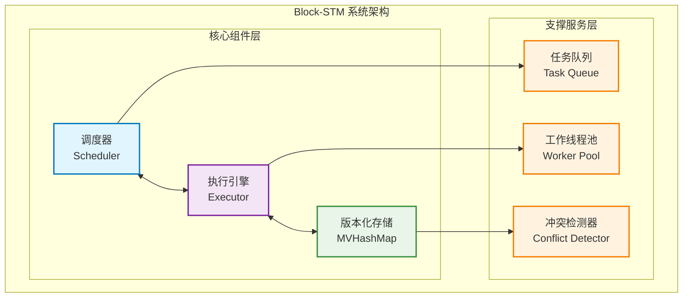
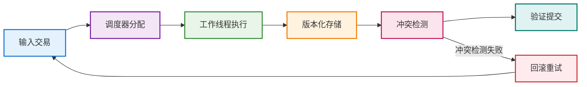
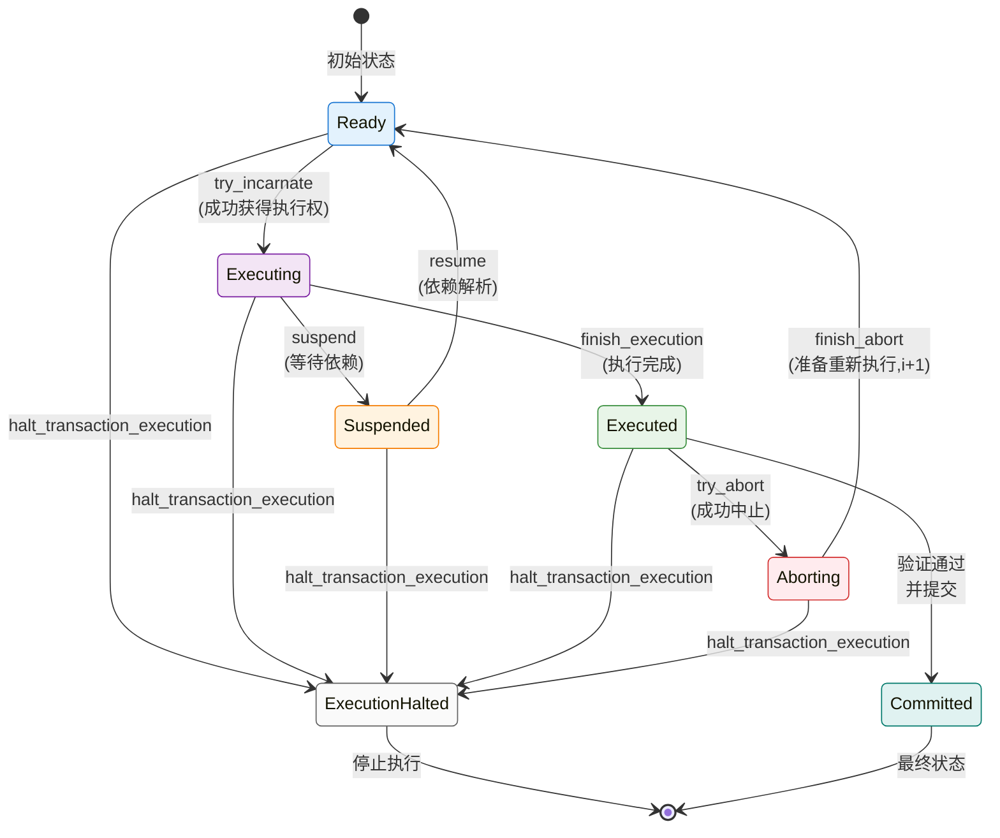
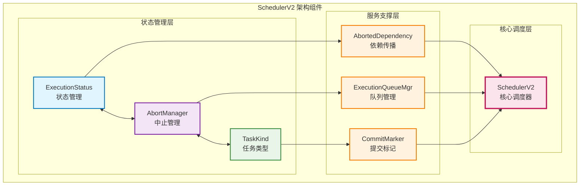
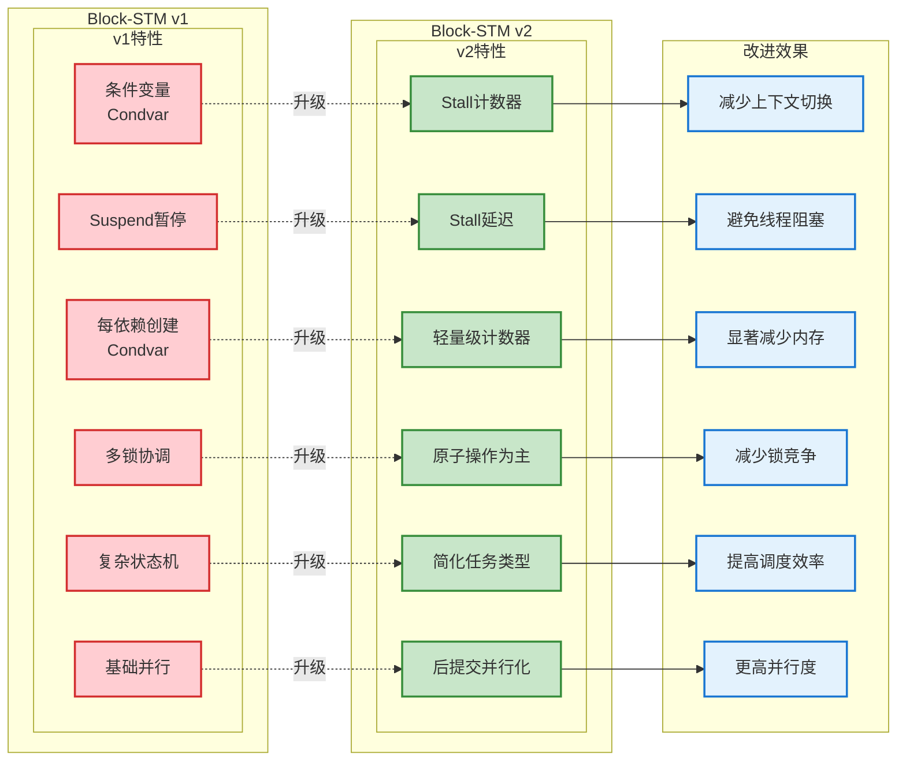
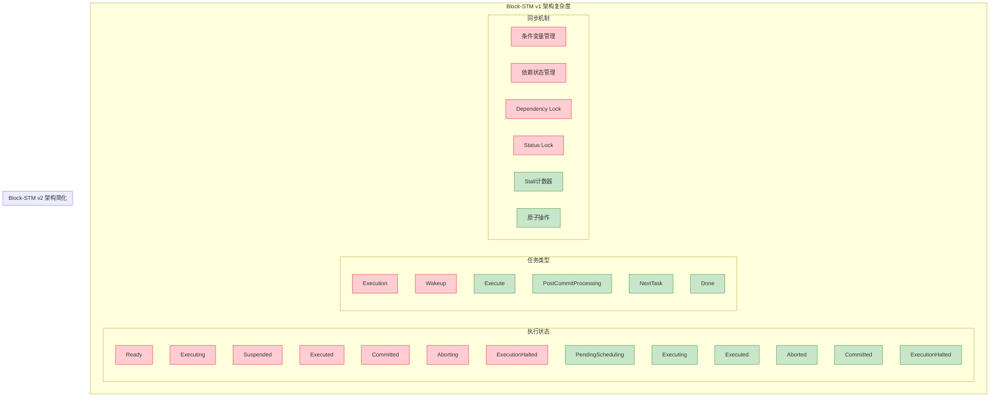
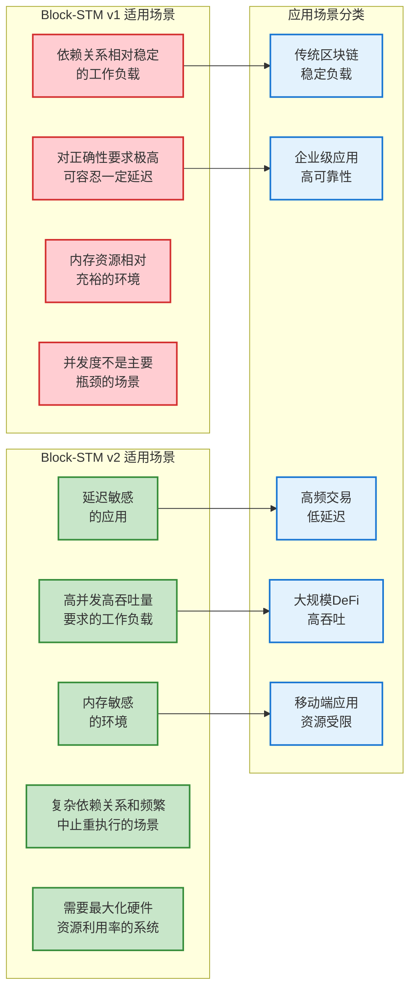

# Block-STM 核心组件与架构解析

## 创建时间
2025-08-22 14:30

## 文档概述

本文档深入解析Aptos Block-STM并行执行引擎的核心组件、架构设计和技术实现。通过详细的源码分析，全面介绍Block-STM v1和v2版本的设计理念、关键机制和性能优化策略。

---

# 第一章：核心组件架构详解

## 1.1 系统整体架构

### Block-STM系统架构概览

Block-STM (Software Transactional Memory) 是Aptos区块链的核心并行执行引擎，采用乐观并发控制机制，实现交易的高效并行处理。系统架构围绕以下几个核心组件构建：



### 各组件职责划分

**1. 调度器 (Scheduler)**
- **职责**: 管理交易执行顺序，分配工作任务
- **实现文件**: `scheduler.rs` (v1) / `scheduler_v2.rs` (v2)
- **核心功能**: 任务调度、依赖管理、提交协调

**2. 执行引擎 (Executor)** 
- **职责**: 协调并行执行流程，管理工作线程
- **实现文件**: `executor.rs`
- **核心功能**: 线程池管理、交易执行、结果处理

**3. 版本化存储 (MVHashMap)**
- **职责**: 提供多版本并发控制的数据存储
- **实现文件**: `mvhashmap/lib.rs`
- **核心功能**: 版本化读写、冲突检测、状态管理

### 数据流向与交互关系

系统中的数据流转遵循以下模式：



## 1.2 MVHashMap多版本数据结构

MVHashMap是Block-STM系统的存储基础，实现了多版本并发控制(MVCC)机制。它允许多个交易并发读写同一数据，通过版本化管理避免读写冲突。

### 核心数据结构设计

**MVHashMap主结构** (`mvhashmap/lib.rs:65-75`):

```rust
pub struct MVHashMap<K, T, V: TransactionWrite, I: Clone> {
    // 简单版本化数据存储 (非资源组数据)
    data: VersionedData<K, V>,
    // 资源组数据存储，内部包含不同标签映射的值
    group_data: VersionedGroupData<K, T, V>,
    // 延迟字段版本化存储
    delayed_fields: VersionedDelayedFields<I>,
    
    // Move模块缓存，关联版本号
    module_cache: SyncModuleCache<ModuleId, CompiledModule, Module, AptosModuleExtension, Option<TxnIndex>>,
    // 脚本缓存
    script_cache: SyncScriptCache<[u8; 32], CompiledScript, Script>,
    
    // 可选的日志记录器
    logger: Option<Arc<dyn MVLogger>>,
}
```

### 多版本并发控制(MVCC)原理

**版本化数据结构** (`versioned_data.rs:75-78`):

```rust
pub struct VersionedData<K, V> {
    // 每个键映射到版本化值的内部表示
    values: DashMap<K, VersionedValue<V>>,
    // 基础值的总大小统计
    total_base_value_size: AtomicU64,
}
```

**版本化值的内部表示** (`versioned_data.rs:68-72`):

```rust
struct VersionedValue<V> {
    // 从交易索引到对应条目的BTreeMap
    versioned_map: BTreeMap<ShiftedTxnIndex, CachePadded<Entry<EntryCell<V>>>>,
}
```

### 条目类型与状态管理

**条目结构** (`versioned_data.rs:39-46`):

```rust
struct Entry<V> {
    value: V,                    // 实际内容
    flag: AtomicBool,           // 标记条目为"写估算"，原子操作确保线程安全
}
```

**条目内容类型** (`versioned_data.rs:49-66`):

```rust
enum EntryCell<V> {
    // 资源写入记录
    ResourceWrite {
        incarnation: Incarnation,              // 写入交易的版本号
        value_with_layout: ValueWithLayout<V>, // 共享指针存储的数据
        dependencies: Mutex<BTreeSet<(TxnIndex, Incarnation)>>, // 已注册读取的交易集合
    },
    
    // Delta操作记录 (用于聚合器)
    Delta(DeltaOp, Option<u128>), // Delta操作和可选的聚合值快捷方式
}
```

### 关键函数实现解析

**1. MVHashMap初始化** (`mvhashmap/lib.rs:84-96`):

```rust
pub fn new() -> MVHashMap<K, T, V, I> {
    MVHashMap {
        data: VersionedData::empty(),           // 空的版本化数据
        group_data: VersionedGroupData::empty(), // 空的资源组数据
        delayed_fields: VersionedDelayedFields::empty(), // 空的延迟字段
        
        module_cache: SyncModuleCache::empty(),  // 空的模块缓存
        script_cache: SyncScriptCache::empty(),  // 空的脚本缓存
        logger: None,                            // 无日志记录器
    }
}
```

**2. 带日志记录器的初始化** (`mvhashmap/lib.rs:98-109`):

```rust
pub fn new_with_logger(logger: Arc<dyn MVLogger>) -> MVHashMap<K, T, V, I> {
    // 与上述类似，但包含日志记录器引用
    MVHashMap {
        // ... 其他字段初始化相同
        logger: Some(logger),  // 设置日志记录器
    }
}
```

### 版本化读写机制

**写操作流程**:
1. 创建新的Entry条目，包含数据和版本信息
2. 将条目插入到对应键的VersionedValue的BTreeMap中
3. 使用交易索引作为版本标识符
4. 记录写入操作的日志（如果配置了logger）

**读操作流程**:
1. 根据键查找对应的VersionedValue
2. 在BTreeMap中查找最新的可读版本（小于等于当前交易索引）
3. 注册读依赖关系到条目的dependencies集合中
4. 返回版本化的值

### 冲突检测算法

**依赖追踪机制**:
- 每个写入条目维护一个读依赖集合 `dependencies: Mutex<BTreeSet<(TxnIndex, Incarnation)>>`
- 当交易读取某个键时，将其(txn_id, incarnation)添加到依赖集合
- 当交易写入同一键时，检查所有依赖的交易是否需要重新执行

**冲突解决策略**:
- 采用乐观并发控制，允许交易先执行再验证
- 检测到冲突时，中止相关交易并标记需要重新执行
- 使用估算标记(FLAG_ESTIMATE)管理临时状态

### 性能优化特性

**1. 缓存友好设计**:
```rust
versioned_map: BTreeMap<ShiftedTxnIndex, CachePadded<Entry<EntryCell<V>>>>
```
- 使用`CachePadded`避免false sharing问题
- BTreeMap保证版本的有序性，便于查找最新版本

**2. 原子操作优化**:
```rust
flag: AtomicBool,  // 估算标记的原子更新
total_base_value_size: AtomicU64,  // 基础值大小的原子统计
```

**3. 延迟计算**:
```rust
Delta(DeltaOp, Option<u128>)  // Delta的聚合值快捷方式
```
- 延迟计算聚合器的最终值，避免重复计算
- 缓存中间结果提升性能

## 1.3 执行器引擎系统

执行器引擎是Block-STM的核心调度和执行组件，负责协调并行执行流程、管理工作线程池和处理交易执行结果。

### BlockExecutor核心结构

**主执行器结构** (`executor.rs:101-108`):

```rust
pub struct BlockExecutor<T, E, S, L, TP> {
    // 活跃并发任务数，对应参与并行执行的最大rayon线程数
    config: BlockExecutorConfig,
    // 执行器线程池
    executor_thread_pool: Arc<rayon::ThreadPool>,
    // 可选的交易提交钩子
    transaction_commit_hook: Option<L>,
    // 幽灵类型，用于编译时类型检查
    phantom: PhantomData<fn() -> (T, E, S, L, TP)>,
}
```

**类型约束说明**:
- `T: BlockExecutableTransaction` - 可执行的区块交易类型
- `E: ExecutorTask<Txn = T>` - 执行器任务类型，必须与交易类型匹配
- `S: TStateView<Key = T::Key> + Sync` - 状态视图，必须线程安全
- `L: TransactionCommitHook<Output = E::Output>` - 交易提交钩子
- `TP: TxnProvider<T> + Sync` - 交易提供者，必须线程安全

### 执行器初始化与配置

**构造函数** (`executor.rs:118-138`):

```rust
pub fn new(
    config: BlockExecutorConfig,
    executor_thread_pool: Arc<ThreadPool>,
    transaction_commit_hook: Option<L>,
) -> Self {
    let num_cpus = num_cpus::get();
    // 确保并发级别合理：大于0且不超过CPU核心数
    assert!(
        config.local.concurrency_level > 0 && config.local.concurrency_level <= num_cpus,
        "Parallel execution concurrency level {} should be between 1 and number of CPUs ({})",
        config.local.concurrency_level,
        num_cpus,
    );
    Self {
        config,
        executor_thread_pool,
        transaction_commit_hook,
        phantom: PhantomData,
    }
}
```

### 线程池管理策略

**工作线程主循环v2** (`executor.rs:1721-1748`):

工作线程的核心执行逻辑分为以下几个阶段：

```rust
fn worker_loop_v2(
    &self,
    block: &TP,                    // 交易区块提供者
    environment: &AptosEnvironment, // Aptos环境配置
    _worker_id: u32,               // 工作线程ID（当前版本未使用）
    num_workers: u32,              // 工作线程总数
    shared_sync_params: &SharedSyncParams<'_, '_, T, E, S>, // 共享同步参数
    start_delayed_field_id_counter: u32, // 延迟字段ID计数器起始值
) -> Result<(), PanicOr<ParallelBlockExecutionError>>
```

### 任务分发机制

**任务类型枚举**:
工作线程通过调度器获取不同类型的任务：

```rust
match scheduler.next_task()? {
    // 执行任务：处理指定交易的指定版本
    TaskKind::Execute(txn_idx, incarnation) => {
        // 执行交易逻辑
    },
    
    // 后提交处理任务：处理已提交交易的后续工作
    TaskKind::PostCommitProcessing(txn_idx) => {
        // 后提交处理逻辑
    },
    
    // 获取下一任务：当前无可用任务，系统空闲等待
    TaskKind::NextTask => {
        // 简单的线程让步，避免繁忙等待
        std::thread::yield_now();
    },
    
    // 完成标记：所有任务已完成，退出工作循环
    TaskKind::Done => {
        break;
    },
}
```

### 执行结果处理流程

**执行状态类型** (`executor.rs:145-164`):

```rust
match execution_result {
    // 成功执行或跳过剩余交易
    ExecutionStatus::Success(output) | ExecutionStatus::SkipRest(output) => {
        Ok(Some(output))
    },
    
    // 推测执行中止错误
    ExecutionStatus::SpeculativeExecutionAbortError(_msg) => {
        // 捕获延迟字段读取错误
        read_set.capture_delayed_field_read_error(&PanicOr::Or(
            MVDelayedFieldsError::DeltaApplicationFailure,
        ));
        Ok(None)
    },
    
    // 执行中止
    ExecutionStatus::Abort(_err) => Ok(None),
    
    // 延迟字段代码不变性错误
    ExecutionStatus::DelayedFieldsCodeInvariantError(msg) => {
        Err(code_invariant_error(format!(
            "[Execution] At txn {}, failed with DelayedFieldsCodeInvariantError: {:?}",
            txn_idx, msg
        )))
    },
}
```

### 资源组处理机制

**资源组输出处理v2** (`executor.rs:169-235`):

BlockSTMv2版本对资源组的处理相比v1进行了优化：

```rust
fn process_resource_group_output_v2(
    maybe_output: Option<&E::Output>,
    idx_to_execute: TxnIndex,
    incarnation: Incarnation,
    last_input_output: &TxnLastInputOutput<T, E::Output, E::Error>,
    versioned_cache: &MVHashMap<T::Key, T::Tag, T::Value, DelayedFieldID>,
    abort_manager: &mut AbortManager,
) -> Result<(), PanicError>
```

**关键优化点**:
1. **写入顺序优化**: v2中应用新组写入与清理先前写入的顺序与v1相反，避免了克隆组键和先前标签的必要性
2. **依赖失效处理**: 使用`abort_manager.invalidate_dependencies()`统一处理依赖失效
3. **元数据处理**: 分别处理组元数据和组大小，使用专门的API

### 性能监控与日志集成

**任务执行统计** (`executor.rs:1793-1797`):

```rust
// 记录任务统计信息
if let Some(logger) = crate::block_stm_logger::get_global_logger() {
    logger.record_task_type("Execute");       // 记录任务类型
    logger.sample_concurrent_executions(num_workers); // 采样并发执行情况
}
```

**错误检测与回退**:
```rust
if incarnation > num_workers.pow(2) + num_txns + 30 {
    // 检测异常高版本号，可能存在执行-失效循环的bug
    error!("Observed incarnation {} of txn {txn_idx}", incarnation);
    return Err(PanicOr::Or(ParallelBlockExecutionError::IncarnationTooHigh));
}
```

### 共享同步参数

执行器通过`SharedSyncParams`结构在工作线程间共享关键组件：

```rust
struct SharedSyncParams<'a, 'b, T, E, S> {
    base_view: &'a S,                    // 基础状态视图
    scheduler: &'a SchedulerV2,          // v2调度器
    versioned_cache: &'a MVHashMap<...>, // 版本化缓存
    global_module_cache: &'a GlobalModuleCache<...>, // 全局模块缓存
    last_input_output: &'a TxnLastInputOutput<...>,  // 上次输入输出记录
    delayed_field_id_counter: &'a AtomicU32,         // 延迟字段ID计数器
    block_limit_processor: &'a ExplicitSyncWrapper<...>, // 区块限制处理器
    final_results: &'a ExplicitSyncWrapper<Vec<E::Output>>, // 最终结果存储
}
```

这种设计模式确保了所有工作线程都能安全地访问共享状态，同时最小化锁竞争。

---

# 第二章：Block-STM v1深度解析

Block-STM v1版本实现了基础的乐观并发控制机制，采用suspend机制处理交易间的依赖关系。本章深入分析v1的设计理念和实现细节。

## 2.1 调度器系统设计

Block-STM v1的调度器是整个并行执行系统的大脑，负责任务分配、状态管理和依赖协调。

### Scheduler核心结构

**主调度器结构** (`scheduler.rs:267-299`):

```rust
pub struct Scheduler {
    /// 要执行的交易数量，不可变
    num_txns: TxnIndex,
    
    /// 索引i映射到依赖于交易i的其他交易的索引集合
    /// 即当交易i的下一个版本完成时，应该重新执行的交易
    txn_dependency: Vec<CachePadded<Mutex<Vec<TxnIndex>>>>,
    
    /// 索引i映射到交易i的最新状态
    txn_status: Vec<CachePadded<(RwLock<ExecutionStatus>, RwLock<ValidationStatus>)>>,
    
    /// 下一个要提交的交易，以及必须成功验证的波次下界
    commit_state: CachePadded<ExplicitSyncWrapper<(TxnIndex, Wave)>>,
    
    /// 跟踪需要执行的所有交易索引的最小值的共享索引
    execution_idx: AtomicU32,
    
    /// 前32位标识验证波次，后32位包含跟踪需要验证的所有交易索引的最小值
    validation_idx: AtomicU64,
}
```

### 执行状态枚举详解

**ExecutionStatus状态机** (`scheduler.rs:143-158`):

```rust
enum ExecutionStatus {
    // 准备就绪，等待执行
    Ready(Incarnation, ExecutionTaskType),
    
    // 正在执行中
    Executing(Incarnation, ExecutionTaskType),
    
    // 暂停状态，等待依赖解析
    Suspended(Incarnation, DependencyCondvar),
    
    // 执行完成，等待验证
    Executed(Incarnation),
    
    // 已提交状态
    Committed(Incarnation),
    
    // 中止进行中
    Aborting(Incarnation),
    
    // 执行已停止
    ExecutionHalted,
}
```

**状态转换图解**:



### 任务类型系统

**SchedulerTask枚举** (`scheduler.rs:87-97`):

```rust
pub enum SchedulerTask {
    /// 执行任务：包含交易索引、版本号和执行类型
    ExecutionTask(TxnIndex, Incarnation, ExecutionTaskType),
    
    /// 验证任务：包含交易索引、版本号和波次信息
    ValidationTask(TxnIndex, Incarnation, Wave),
    
    /// 重试：没有可用任务，需要重新尝试
    Retry,
    
    /// 完成：没有更多任务，调度器完成工作
    Done,
}
```

**ExecutionTaskType区分** (`scheduler.rs:77-82`):

```rust
pub enum ExecutionTaskType {
    /// 普通执行任务
    Execution,
    
    /// 唤醒任务：用于唤醒因依赖而暂停的执行
    Wakeup(DependencyCondvar),
}
```

### ArmedLock机制

**ArmedLock设计** (`scheduler.rs:24-52`):

```rust
pub struct ArmedLock {
    // 最低位: 1 -> 未锁定; 0 -> 已锁定
    // 第二位: 1 -> 有工作; 0 -> 无工作
    locked: AtomicU64,
}

impl ArmedLock {
    pub fn new() -> Self {
        Self {
            locked: AtomicU64::new(3), // 初始状态: 未锁定且有工作
        }
    }
    
    // 仅当锁未锁定且有工作要做时，try_lock才会成功
    pub fn try_lock(&self) -> bool {
        self.locked
            .compare_exchange_weak(3, 0, Ordering::Acquire, Ordering::Relaxed)
            .is_ok()
    }
    
    pub fn unlock(&self) {
        self.locked.fetch_or(1, Ordering::Release);
    }
    
    pub fn arm(&self) {
        self.locked.fetch_or(2, Ordering::Release);
    }
}
```

**ArmedLock的作用**:
- 实现高效的条件锁机制
- 结合锁状态和工作可用性状态
- 避免不必要的锁竞争

### 依赖管理系统

**DependencyStatus枚举** (`scheduler.rs:55-63`):

```rust
pub enum DependencyStatus {
    // 依赖尚未解析
    Unresolved,
    
    // 依赖已解析
    Resolved,
    
    // 并行执行已停止
    ExecutionHalted,
}
```

**条件变量依赖机制**:
```rust
type DependencyCondvar = Arc<(Mutex<DependencyStatus>, Condvar)>;
```

**DependencyResult返回类型** (`scheduler.rs:67-72`):

```rust
pub enum DependencyResult {
    // 返回依赖条件变量，需要等待
    Dependency(DependencyCondvar),
    
    // 依赖已解析，可以继续执行
    Resolved,
    
    // 执行已停止
    ExecutionHalted,
}
```

### 验证状态管理

**ValidationStatus结构** (`scheduler.rs:240-257`):

```rust
struct ValidationStatus {
    /// 在该交易索引处触发的最大波次
    max_triggered_wave: Wave,
    
    /// 为了提交交易必须成功验证的波次
    required_wave: Wave,
    
    /// 对应交易成功验证的最大波次
    maybe_max_validated_wave: Option<Wave>,
}
```

**波次(Wave)管理机制**:

1. **max_triggered_wave**: 每次validation_idx递减时递增，记录触发的最大验证波次
2. **required_wave**: 当执行完成的交易在validation_idx之下时更新
3. **maybe_max_validated_wave**: 验证成功时更新为当前validation_idx的波次

### 原子索引管理

**执行索引** (`execution_idx: AtomicU32`):
- 跟踪需要执行的所有交易索引的最小值
- 线程递增索引并尝试为对应交易创建执行任务
- 实现基于计数的并发有序集合

**验证索引** (`validation_idx: AtomicU64`):
- 前32位：验证波次标识
- 后32位：需要验证的交易索引最小值
- 每当由于交易需要验证而减少validation_idx时，波次递增

### 任务调度算法

调度器的核心算法基于以下原则：

1. **乐观执行**: 允许交易并行执行，后续验证正确性
2. **依赖跟踪**: 维护交易间的读写依赖关系
3. **状态驱动**: 基于交易状态决定下一步操作
4. **波次验证**: 确保验证的顺序性和正确性

## 2.2 Suspend机制详细原理

Suspend机制是Block-STM v1处理交易间依赖的核心机制，当交易执行过程中遇到依赖时，会暂停执行并等待依赖解析。

### 依赖条件变量机制

**DependencyCondvar定义** (`scheduler.rs:64`):

```rust
type DependencyCondvar = Arc<(Mutex<DependencyStatus>, Condvar)>;
```

这是一个包装了互斥锁和条件变量的智能指针，用于线程间的依赖同步：
- `Mutex<DependencyStatus>`: 保护依赖状态的互斥锁
- `Condvar`: 用于线程等待和通知的条件变量
- `Arc`: 允许多线程共享同一个依赖条件变量

**依赖状态枚举** (`scheduler.rs:55-63`):

```rust
pub enum DependencyStatus {
    // 依赖尚未解析
    Unresolved,
    // 依赖已解析
    Resolved,
    // 并行执行已停止
    ExecutionHalted,
}
```

### wait_for_dependency核心流程

**函数签名** (`scheduler.rs:675-679`):

```rust
fn wait_for_dependency(
    &self,
    txn_idx: TxnIndex,          // 当前等待的交易索引
    dep_txn_idx: TxnIndex,      // 依赖的交易索引
) -> Result<DependencyResult, PanicError>
```

**执行流程详解** (`scheduler.rs:680-725`):

**1. 边界条件检查** (`scheduler.rs:680-684`):
```rust
if txn_idx <= dep_txn_idx || dep_txn_idx >= self.num_txns {
    return Err(code_invariant_error(
        "In wait_for_dependency: {txn_idx} > {dep_txn_idx}, num txns = {self.num_txns}",
    ));
}
```
- 确保依赖关系正确：当前交易索引必须大于依赖交易索引
- 确保依赖交易索引在有效范围内

**2. 创建依赖条件变量** (`scheduler.rs:689-690`):
```rust
let dep_condvar = Arc::new((Mutex::new(DependencyStatus::Unresolved), Condvar::new()));
```

**3. 获取依赖锁并检查执行状态** (`scheduler.rs:692-706`):
```rust
let mut stored_deps = self.txn_dependency[dep_txn_idx as usize].lock();

if self.is_executed(dep_txn_idx, true).is_some() {
    // 依赖交易已执行完毕，无需等待
    return Ok(DependencyResult::Resolved);
}
```

关键点：
- 先获取依赖交易的依赖列表锁
- 检查依赖交易是否已经执行完毕（包括已提交状态）
- 如果已执行，直接返回Resolved避免创建僵尸依赖

**4. 暂停当前交易** (`scheduler.rs:714-716`):
```rust
if !self.suspend(txn_idx, dep_condvar.clone())? {
    return Ok(DependencyResult::ExecutionHalted);
}
```

**5. 注册依赖关系** (`scheduler.rs:720`):
```rust
stored_deps.push(txn_idx);
```

将当前交易添加到依赖交易的依赖列表中，确保依赖交易完成时能够唤醒当前交易。

### suspend函数实现

**函数实现** (`scheduler.rs:943-960`):

```rust
fn suspend(
    &self,
    txn_idx: TxnIndex,
    dep_condvar: DependencyCondvar,
) -> Result<bool, PanicError> {
    let mut status = self.txn_status[txn_idx as usize].0.write();
    match *status {
        ExecutionStatus::Executing(incarnation, _) => {
            *status = ExecutionStatus::Suspended(incarnation, dep_condvar);
            Ok(true)
        },
        ExecutionStatus::ExecutionHalted => Ok(false),
        _ => Err(code_invariant_error(format!(
            "Unexpected status {:?} in suspend",
            &*status,
        ))),
    }
}
```

**状态转换逻辑**:
- **成功暂停**: `Executing(incarnation, _)` → `Suspended(incarnation, dep_condvar)`
- **已停止执行**: `ExecutionHalted` → 返回false，表示无法暂停
- **其他状态**: 抛出代码不变性错误

### resume函数实现

**函数实现** (`scheduler.rs:964-980`):

```rust
fn resume(&self, txn_idx: TxnIndex) -> Result<(), PanicError> {
    let mut status = self.txn_status[txn_idx as usize].0.write();
    match &*status {
        ExecutionStatus::Suspended(incarnation, dep_condvar) => {
            *status = ExecutionStatus::Ready(
                *incarnation,
                ExecutionTaskType::Wakeup(dep_condvar.clone()),
            );
            Ok(())
        },
        ExecutionStatus::ExecutionHalted => Ok(()),
        _ => Err(code_invariant_error(format!(
            "Unexpected status {:?} in resume",
            &*status,
        ))),
    }
}
```

**状态转换逻辑**:
- **成功恢复**: `Suspended(incarnation, dep_condvar)` → `Ready(incarnation, Wakeup(dep_condvar))`
- **已停止执行**: `ExecutionHalted` → 静默处理，不做操作
- **其他状态**: 抛出代码不变性错误

**关键特性**:
- 恢复后的任务类型变为`ExecutionTaskType::Wakeup`，包含原来的条件变量
- 这使得调度器能够区分新任务和唤醒任务

### 依赖解析与唤醒流程

**依赖唤醒函数** (`scheduler.rs:497-520`):

```rust
fn wake_dependencies_after_execution(&self, txn_idx: TxnIndex) -> Result<(), PanicError> {
    let txn_deps: Vec<TxnIndex> = {
        let mut stored_deps = self.txn_dependency[txn_idx as usize].lock();
        // 获取锁时，取出依赖向量
        std::mem::take(&mut stored_deps)
    };

    // 标记依赖为已解析，并找到最小索引
    let mut min_dep = None;
    for dep in txn_deps {
        self.resume(dep)?;

        if min_dep.is_none() || min_dep.is_some_and(|min_dep| min_dep > dep) {
            min_dep = Some(dep);
        }
    }
    if let Some(execution_target_idx) = min_dep {
        // 减少执行索引以确保已解析的依赖能够重新执行
        self.execution_idx
            .fetch_min(execution_target_idx, Ordering::SeqCst);
    }
    Ok(())
}
```

**执行逻辑**:
1. **获取所有依赖交易**: 使用`std::mem::take`原子性地取出所有等待当前交易的依赖列表
2. **逐个唤醒**: 对每个依赖交易调用`resume()`
3. **调整执行索引**: 将`execution_idx`调整到最小的依赖交易索引，确保这些交易能够被重新调度执行

### 线程同步与安全性

**锁获取顺序** (`scheduler.rs:694-696`):
```
// 注释：is_executed & suspend调用获取（不同的，状态）互斥锁，同时持有（依赖）互斥锁。
// 这是调度器中线程可能持有>1个互斥锁的唯一位置。因此，获取总是以相同顺序发生（这里），不会死锁。
```

**安全保证**:
1. **一致的锁顺序**: 总是先获取依赖锁，再获取状态锁
2. **原子状态检查**: 在持有依赖锁的情况下检查执行状态，防止竞态条件
3. **条件变量同步**: 使用标准的mutex+condvar模式进行线程同步

### 执行停止处理

**停止执行函数** (`scheduler.rs:746-763`):

```rust
fn halt_transaction_execution(&self, txn_idx: TxnIndex) {
    let mut status = self.txn_status[txn_idx as usize].0.write();

    // 总是替换状态
    match std::mem::replace(&mut *status, ExecutionStatus::ExecutionHalted) {
        ExecutionStatus::Suspended(_, condvar)
        | ExecutionStatus::Ready(_, ExecutionTaskType::Wakeup(condvar))
        | ExecutionStatus::Executing(_, ExecutionTaskType::Wakeup(condvar)) => {
            // 条件变量锁必须总是内层获取
            let (lock, cvar) = &*condvar;

            let mut lock = lock.lock();
            *lock = DependencyStatus::ExecutionHalted;
            cvar.notify_one();
        },
        _ => (),
    }
}
```

**正确性保证**:
1. **状态替换**: 无条件将状态设为`ExecutionHalted`
2. **条件变量通知**: 如果交易包含条件变量，设置状态为`ExecutionHalted`并通知等待线程
3. **防止死锁**: 确保等待在条件变量上的线程能够被唤醒

### Suspend机制的性能特性

**优势**:
1. **细粒度控制**: 只暂停有依赖的交易，其他交易继续并行执行
2. **避免忙等待**: 使用条件变量实现高效的线程同步
3. **最小化重执行**: 仅在必要时重新执行交易

**开销**:
1. **锁竞争**: 需要获取多个锁进行状态检查和更新
2. **内存开销**: 每个依赖关系需要创建条件变量
3. **上下文切换**: 线程暂停和恢复涉及系统调用开销

**适用场景**:
- 依赖关系相对稳定的工作负载
- 读写冲突不太频繁的场景
- 对延迟敏感但可以接受一定暂停开销的应用

## 2.3 V1执行流程分析

Block-STM v1的执行流程涉及多个阶段的协调工作，从任务调度到交易执行，再到依赖解析和提交。本节分析完整的执行流程。

### 整体执行流程概览

```mermaid
flowchart TD
    subgraph "Block-STM v1 执行流程"
        subgraph "1. 初始化阶段"
            A1[创建Scheduler<br/>num_txns]
            A2[初始化MVHashMap]
            A3[启动工作线程池]
        end
        
        subgraph "2. 任务调度循环"
            B1[worker_thread.next_task]
            B2[ExecutionTask /<br/>ValidationTask]
            B3[Done / Retry]
        end
        
        subgraph "3. 交易执行阶段"
            C1[乐观执行<br/>try_execute]
            C2[读写依赖检测]
            C3[状态更新<br/>Executed / Suspended]
        end
        
        subgraph "4. 验证阶段"
            D1[读写集合验证]
            D2[依赖验证]
            D3[Abort / Validate]
        end
        
        subgraph "5. 提交阶段"
            E1[顺序提交<br/>try_commit]
            E2[状态最终确认]
            E3[清理资源]
        end
    end
    
    A1 --> A2 --> A3 --> B1
    B1 --> B2 --> B3
    B2 --> C1 --> C2 --> C3
    C3 --> D1 --> D2 --> D3
    D3 --> E1 --> E2 --> E3
    
    B3 -->|Retry| B1
    D3 -->|Abort| C1
    
    style A1 fill:#e3f2fd,stroke:#1976d2,stroke-width:2px
    style A2 fill:#e3f2fd,stroke:#1976d2,stroke-width:2px
    style A3 fill:#e3f2fd,stroke:#1976d2,stroke-width:2px
    style B1 fill:#f3e5f5,stroke:#7b1fa2,stroke-width:2px
    style B2 fill:#f3e5f5,stroke:#7b1fa2,stroke-width:2px
    style B3 fill:#f3e5f5,stroke:#7b1fa2,stroke-width:2px
    style C1 fill:#e8f5e8,stroke:#388e3c,stroke-width:2px
    style C2 fill:#e8f5e8,stroke:#388e3c,stroke-width:2px
    style C3 fill:#e8f5e8,stroke:#388e3c,stroke-width:2px
    style D1 fill:#fff3e0,stroke:#f57c00,stroke-width:2px
    style D2 fill:#fff3e0,stroke:#f57c00,stroke-width:2px
    style D3 fill:#fff3e0,stroke:#f57c00,stroke-width:2px
    style E1 fill:#e0f2f1,stroke:#00796b,stroke-width:2px
    style E2 fill:#e0f2f1,stroke:#00796b,stroke-width:2px
    style E3 fill:#e0f2f1,stroke:#00796b,stroke-width:2px
```



### 任务调度主循环

**next_task函数实现** (`scheduler.rs:451-486`):

```rust
pub fn next_task(&self) -> SchedulerTask {
    loop {
        if self.done() {
            // 没有更多任务
            return SchedulerTask::Done;
        }

        let (idx_to_validate, wave) =
            Self::unpack_validation_idx(self.validation_idx.load(Ordering::Acquire));

        let idx_to_execute = self.execution_idx.load(Ordering::Acquire);

        let prefer_validate = idx_to_validate < min(idx_to_execute, self.num_txns)
            && !self.never_executed(idx_to_validate);

        if !prefer_validate && idx_to_execute >= self.num_txns {
            return SchedulerTask::Retry;
        }

        if prefer_validate {
            if let Some((txn_idx, incarnation, wave)) =
                self.try_validate_next_version(idx_to_validate, wave)
            {
                return SchedulerTask::ValidationTask(txn_idx, incarnation, wave);
            }
        }

        if idx_to_execute < self.num_txns {
            if let Some((txn_idx, incarnation, execution_task_type)) =
                self.try_execute_next_version()
            {
                return SchedulerTask::ExecutionTask(txn_idx, incarnation, execution_task_type);
            }
        }
    }
}
```

**调度策略分析**:

1. **优先级决策** (`scheduler.rs:463-464`):
```rust
let prefer_validate = idx_to_validate < min(idx_to_execute, self.num_txns)
    && !self.never_executed(idx_to_validate);
```

验证优先条件：
- `idx_to_validate < min(idx_to_execute, self.num_txns)`: 验证索引低于执行索引
- `!self.never_executed(idx_to_validate)`: 该交易至少执行过一次

2. **执行索引管理**:
```rust
fn try_execute_next_version(&self) -> Option<(TxnIndex, Incarnation, ExecutionTaskType)> {
    let idx_to_execute = self.execution_idx.fetch_add(1, Ordering::SeqCst);

    if idx_to_execute >= self.num_txns {
        return None;
    }

    // 如果成功incarnate（将状态从ready改为executing），
    // 返回执行任务的版本，否则返回None
    self.try_incarnate(idx_to_execute)
        .map(|(incarnation, execution_task_type)| {
            (idx_to_execute, incarnation, execution_task_type)
        })
}
```

### 交易执行流程

**执行任务处理**:

```rust
match scheduler_task {
    SchedulerTask::ExecutionTask(txn_idx, incarnation, execution_task_type) => {
        // 1. 准备执行环境
        let mut read_set = ReadDescriptor::new();
        let mut write_set = WriteDescriptor::new();
        
        // 2. 执行交易逻辑
        let execution_result = executor.execute_transaction(
            txn_idx,
            incarnation,
            &mut read_set,
            &mut write_set,
        );
        
        // 3. 处理执行结果
        match execution_result {
            ExecutionStatus::Success(output) => {
                // 成功执行，更新状态
                scheduler.finish_execution(txn_idx, incarnation, revalidate_suffix)?;
            },
            ExecutionStatus::Abort(_) => {
                // 执行中止，进行清理
                scheduler.finish_abort(txn_idx, incarnation)?;
            },
            _ => {
                // 其他状态处理...
            }
        }
    }
}
```

### 依赖处理流程

**读取依赖检测**:

当交易读取数据时，可能遇到以下情况：

1. **读取到确定值** - 继续执行
2. **读取到估算值** - 创建依赖关系，暂停执行
3. **读取未初始化值** - 从基础存储读取

**依赖创建过程**:

```rust
// 在MVHashMap中检测到依赖
match mvhashmap.read(&key, txn_idx) {
    Ok(value) => {
        // 成功读取，继续执行
        read_set.record_read(key, value);
    },
    Err(MVDataError::Dependency(dep_txn_idx)) => {
        // 检测到依赖，调用调度器处理
        match scheduler.wait_for_dependency(txn_idx, dep_txn_idx)? {
            DependencyResult::Dependency(condvar) => {
                // 交易被暂停，工作线程在条件变量上等待
                let (lock, cvar) = &*condvar;
                let mut dep_status = lock.lock();
                while *dep_status == DependencyStatus::Unresolved {
                    dep_status = cvar.wait(dep_status);
                }
                
                // 依赖解析后重新尝试读取
                match *dep_status {
                    DependencyStatus::Resolved => {
                        // 重新读取数据
                        continue;
                    },
                    DependencyStatus::ExecutionHalted => {
                        // 执行已停止
                        return ExecutionStatus::ExecutionHalted;
                    },
                    _ => unreachable!(),
                }
            },
            DependencyResult::Resolved => {
                // 依赖已解析，重新尝试读取
                continue;
            },
            DependencyResult::ExecutionHalted => {
                // 执行已停止
                return ExecutionStatus::ExecutionHalted;
            },
        }
    },
    Err(MVDataError::Uninitialized) => {
        // 从基础存储读取
        let base_value = base_storage.read(&key)?;
        mvhashmap.set_base_value(key, base_value);
        continue;
    },
}
```

### 验证流程

**验证任务处理**:

```rust
SchedulerTask::ValidationTask(txn_idx, incarnation, wave) => {
    // 1. 获取交易的读写集
    let read_set = last_input_output.read_set(txn_idx);
    let write_set = last_input_output.write_set(txn_idx);
    
    // 2. 验证读取集合
    let mut validation_passed = true;
    for (key, expected_value) in read_set {
        match mvhashmap.read(&key, txn_idx) {
            Ok(current_value) if current_value == expected_value => {
                // 读取值未变化，验证通过
                continue;
            },
            _ => {
                // 读取值已改变，验证失败
                validation_passed = false;
                break;
            }
        }
    }
    
    // 3. 处理验证结果
    if validation_passed {
        // 验证成功
        scheduler.finish_validation(txn_idx, wave);
    } else {
        // 验证失败，中止交易
        if scheduler.try_abort(txn_idx, incarnation) {
            scheduler.finish_abort(txn_idx, incarnation)?;
        }
    }
}
```

### 提交流程

**try_commit函数分析** (`scheduler.rs:370-421`):

```rust
pub fn try_commit(&self) -> Option<(TxnIndex, Incarnation)> {
    let mut commit_state = self.commit_state.acquire();
    let (commit_idx, commit_wave) = commit_state.dereference_mut();

    if *commit_idx == self.num_txns {
        return None;
    }

    let validation_status = self.txn_status[*commit_idx as usize].1.read();

    // 获取验证状态读锁
    if let Some(status) = self.txn_status[*commit_idx as usize]
        .0
        .try_upgradable_read()
    {
        // 获取执行状态读锁，如有必要可以升级为写锁
        if let ExecutionStatus::Executed(incarnation) = *status {
            // 状态为已执行且我们持有锁

            // 更新commit_state中的波次只使用max_triggered_wave
            *commit_wave = max(*commit_wave, validation_status.max_triggered_wave);
            if let Some(validated_wave) = validation_status.maybe_max_validated_wave {
                if validated_wave >= max(*commit_wave, validation_status.required_wave) {
                    let mut status_write = RwLockUpgradableReadGuard::upgrade(status);
                    // 将执行状态读锁升级为写锁
                    // 可以提交
                    *status_write = ExecutionStatus::Committed(incarnation);

                    *commit_idx += 1;
                    if *commit_idx == self.num_txns {
                        // 所有交易都已提交，并行执行可以结束
                        self.done_marker.store(true, Ordering::SeqCst);
                    }
                    return Some((*commit_idx - 1, incarnation));
                }
            }
        }

        // 交易需要至少重新验证，可能还需要重新执行
        return None;
    }

    // 重新武装以再次尝试提交
    self.queueing_commits_arm();

    None
}
```

**提交条件检查**:

1. **执行状态检查**: 交易必须处于`Executed`状态
2. **波次验证**: `validated_wave >= max(commit_wave, required_wave)`
3. **顺序提交**: 必须按交易索引顺序提交

### 错误处理与恢复

**中止处理流程** (`scheduler.rs:587-631`):

```rust
pub fn finish_abort(
    &self,
    txn_idx: TxnIndex,
    incarnation: Incarnation,
) -> Result<SchedulerTask, PanicError> {
    {
        // 获取txn_idx的验证状态独占锁
        let _validation_status = self.txn_status[txn_idx as usize].1.write();

        self.set_aborted_status(txn_idx, incarnation)?;

        // 安排更高的交易进行验证，跳过txn_idx自身（需要先重新执行）
        self.decrease_validation_idx(txn_idx + 1);
    }

    // txn_idx必须重新执行，如果execution_idx更低，它将被执行
    if self.execution_idx.load(Ordering::Acquire) > txn_idx {
        // 优化：execution_idx高于txn_idx，但降低它可能导致
        // txn_idx和execution_idx之间的所有索引的浪费工作
        if let Some((new_incarnation, execution_task_type)) = self.try_incarnate(txn_idx) {
            return Ok(SchedulerTask::ExecutionTask(
                txn_idx,
                new_incarnation,
                execution_task_type,
            ));
        }
    }

    Ok(SchedulerTask::Retry)
}
```

### V1执行流程的关键特性

**优势**:
1. **细粒度并发控制**: 交易级别的状态管理
2. **动态依赖解析**: 运行时检测和处理依赖
3. **乐观执行**: 先执行后验证，最大化并行度
4. **Wave机制**: 确保验证的正确性和顺序性

**局限性**:
1. **Suspend开销**: 线程暂停和唤醒的系统开销
2. **锁竞争**: 多个锁的协调可能造成竞争
3. **内存消耗**: 条件变量和状态维护的内存开销
4. **复杂性**: 状态机和依赖关系管理的复杂性

**适用场景**:
- 依赖关系稀疏的工作负载
- 对执行正确性要求极高的系统
- 可以容忍一定延迟换取正确性的应用

---

# 第三章：Block-STM v2升级解析

Block-STM v2是对v1的重大升级，引入了Stall机制替代Suspend机制，实现了更高效的依赖管理和更好的性能特性。本章详细分析v2的核心改进和技术实现。

## 3.1 从Suspend到Stall的架构演进

### 核心设计理念的转变

**v1 Suspend机制的局限性**:
1. **线程暂停开销**: 每个依赖关系都需要暂停线程并在条件变量上等待
2. **上下文切换成本**: 线程的暂停和恢复涉及系统级的上下文切换
3. **内存消耗**: 每个依赖关系需要维护条件变量和相关状态
4. **锁竞争**: 多个锁的协调管理容易产生竞争瓶颈

**v2 Stall机制的优势**:
1. **工作窃取模式**: 线程不暂停，而是继续寻找其他可执行的任务
2. **减少上下文切换**: 避免线程级别的暂停和唤醒操作
3. **动态调度**: 基于依赖传播的智能调度决策
4. **内存效率**: 更轻量级的状态管理结构

### SchedulerV2总体架构

**核心组件关系图**:



### 任务类型系统升级

**TaskKind枚举** (`scheduler_v2.rs`中推断的结构):

```rust
pub enum TaskKind {
    /// 执行任务：包含交易索引和版本号
    Execute(TxnIndex, Incarnation),
    
    /// 后提交处理任务：已提交交易的后续处理
    PostCommitProcessing(TxnIndex),
    
    /// 获取下一任务：当前无可用任务
    NextTask,
    
    /// 完成标记：所有任务已完成
    Done,
}
```

**与v1的对比**:
- **简化任务类型**: 移除了复杂的ExecutionTaskType和唤醒机制
- **后提交处理**: 新增专门的后提交处理任务类型
- **更直接的控制流**: 减少了状态机的复杂性

### ExecutionStatuses状态管理

**状态枚举设计** (基于源码分析推断):

```rust
enum ExecutionStatus {
    /// 等待调度
    PendingScheduling(Incarnation),
    
    /// 正在执行
    Executing(Incarnation),
    
    /// 执行完成，等待提交
    Executed(Incarnation),
    
    /// 已中止，准备重新执行
    Aborted(Incarnation),
    
    /// 已提交
    Committed(Incarnation),
    
    /// 停止执行
    ExecutionHalted,
}
```

**关键改进**:
1. **移除Suspended状态**: 不再需要暂停状态
2. **简化状态转换**: 减少了复杂的状态机逻辑
3. **Stall计数**: 每个交易维护一个stall计数器

## 3.2 Stall机制核心实现

### AbortManager依赖失效管理

**AbortManager结构** (`scheduler_v2.rs:127-135`):

```rust
pub(crate) struct AbortManager<'a> {
    owner_txn_idx: TxnIndex,
    owner_incarnation: Incarnation,
    scheduler: &'a SchedulerV2,
    // 交易索引映射表明(owner_txn_idx, owner_incarnation)的写入
    // 使相应交易的读取失效。如果版本号存储在条目中，
    // 则start_abort调用成功，暗示承诺调用finish_abort
    invalidated_dependencies: BTreeMap<TxnIndex, Option<Incarnation>>,
}
```

**依赖失效流程** (`scheduler_v2.rs:151-161`):

```rust
pub(crate) fn invalidate_dependencies(
    &mut self,
    dependencies: BTreeSet<(TxnIndex, Incarnation)>,
) -> Result<(), PanicError> {
    // 可能考虑按版本号逆序迭代，确保失效方法实现
    // 能避免过时的try_abort调用
    for (txn_idx, incarnation) in dependencies {
        self.invalidate(txn_idx, incarnation)?;
    }
    Ok(())
}
```

**智能失效决策** (`scheduler_v2.rs:178-216`):

关键的决策逻辑基于`invalidated_dependencies`映射的状态：

1. **None**: 需要中止尝试，因为此`invalidated_txn_idx`没有先前记录
2. **Some(None)**: 之前的中止尝试失败，用当前`invalidated_incarnation`重试
3. **Some(Some(incarnation))**: 
   - 如果`stored_incarnation < invalidated_incarnation`: 错误，不应该发生
   - 如果`stored_incarnation >= invalidated_incarnation`: 无需操作，已处理

### AbortedDependencies传播机制

**依赖传播结构** (`scheduler_v2.rs:297-301`):

```rust
struct AbortedDependencies {
    is_stalled: bool,                    // 拥有者交易是否被stall
    not_stalled_deps: BTreeSet<TxnIndex>, // 未被stall的依赖
    stalled_deps: BTreeSet<TxnIndex>,     // 已被stall的依赖
}
```

**不变性约束**: `stalled_deps`和`not_stalled_deps`必须始终保持不相交。

**Stall传播算法** (`scheduler_v2.rs:322-356`):

```rust
fn add_stall(
    &mut self,
    owner_txn: TxnIndex,
    statuses: &ExecutionStatuses,
    stall_propagation_queue: &mut BTreeSet<usize>,
) -> Result<(), PanicError> {
    // 记录stall传播日志
    if let Some(logger) = get_global_logger() {
        let affected_txns: Vec<TxnIndex> = self.not_stalled_deps.iter().cloned().collect();
        let owner_incarnation = statuses.incarnation(owner_txn);
        let affected_incarnations: Vec<Incarnation> = affected_txns.iter()
            .map(|&txn| statuses.incarnation(txn)).collect();
        logger.log_stall_propagation(
            owner_txn, owner_incarnation, 
            affected_txns, affected_incarnations,
            "add_stall", "dependency_stall"
        );
    }
    
    for idx in &self.not_stalled_deps {
        if statuses.add_stall(*idx, owner_txn)? {
            // 可能需要递归add_stalls
            stall_propagation_queue.insert(*idx as usize);
        }
    }

    // 将所有not_stalled_deps转移到stalled_deps
    self.stalled_deps.append(&mut self.not_stalled_deps);
    self.is_stalled = true;
    Ok(())
}
```

**Stall移除算法** (`scheduler_v2.rs:363-396`):

```rust
fn remove_stall(
    &mut self,
    owner_txn: TxnIndex,
    statuses: &ExecutionStatuses,
    stall_propagation_queue: &mut BTreeSet<usize>,
) -> Result<(), PanicError> {
    // 记录stall移除传播日志
    if let Some(logger) = get_global_logger() {
        // ... 日志记录逻辑
    }
    
    for idx in &self.stalled_deps {
        if statuses.remove_stall(*idx, owner_txn)? {
            // 可能需要递归remove_stalls
            stall_propagation_queue.insert(*idx as usize);
        }
    }

    // 将所有stalled_deps转移回not_stalled_deps
    self.not_stalled_deps.append(&mut self.stalled_deps);
    self.is_stalled = false;
    Ok(())
}
```

### 执行队列管理优化

**ExecutionQueueManager功能** (基于源码分析):

1. **智能调度**: 基于stall状态决定交易是否可以调度
2. **队列管理**: 维护可执行交易的队列
3. **优先级控制**: 优先调度非stall状态的交易
4. **动态调整**: 根据依赖关系动态调整队列状态

**关键指标管理**:
- `executed_once_max_idx`: 跟踪至少执行过一次的最高交易索引
- `min_not_scheduled_idx`: 跟踪尚未调度的最小交易索引

## 3.3 性能优化特性

### 工作窃取模式

**避免线程空闲**:
```rust
// 伪代码：v2工作线程循环
loop {
    match scheduler.next_task() {
        TaskKind::Execute(txn_idx, incarnation) => {
            // 执行交易
            execute_transaction(txn_idx, incarnation);
        },
        TaskKind::PostCommitProcessing(txn_idx) => {
            // 后提交处理
            process_post_commit(txn_idx);
        },
        TaskKind::NextTask => {
            // 暂时没有任务，继续循环而不是阻塞
            std::thread::yield_now();
        },
        TaskKind::Done => {
            break;
        }
    }
}
```

### 后提交处理并行化

**任务优先级** (基于`scheduler_v2.rs:96-104`注释):

1. **后提交处理任务**: 最高优先级，确保已提交工作及时完成
2. **执行任务**: 次优先级，继续推进未完成的交易
3. **控制任务**: 最低优先级，包括NextTask和Done

**并行化优势**:
- 提交后的处理工作可以并行进行
- 减少关键路径上的延迟
- 提高整体吞吐量

### 内存和锁优化

**减少锁竞争**:
1. **细粒度锁**: 针对特定操作使用更细粒度的锁
2. **原子操作**: 大量使用原子操作减少锁需求
3. **无锁队列**: 使用ConcurrentQueue等无锁数据结构

**内存效率**:
1. **移除条件变量**: 不再需要为每个依赖关系创建条件变量
2. **轻量级状态**: 更简洁的状态表示和管理
3. **批量操作**: 批量处理依赖关系减少内存分配

### 智能调度启发式

**Stall传播启发式**:
- 如果交易T_i依赖于被中止的T_j，那么T_i很可能也会被再次中止
- 延迟T_i的重新执行直到T_j稳定，减少浪费的工作
- 通过依赖图传播stall状态，实现智能的级联控制

**执行顺序优化**:
- 优先执行非stall状态的交易
- 基于`executed_once_max_idx`推迟首次重执行
- 智能的队列管理减少不必要的调度开销

## 3.4 提交序列优化

### CommitMarkerFlag提交标记

**提交状态管理**:
```rust
enum CommitMarkerFlag {
    NotCommitted,    // 尚未提交
    CommitStarted,   // 开始提交过程
    Committed,       // 已完成提交
}
```

**顺序提交保证**:
- `next_to_commit_idx`: 维护下一个要提交的交易索引
- `queueing_commits_lock`: 序列化提交钩子的分发，使用ArmedLock实现

### 后提交处理流程

**并行后处理架构**:
1. **提交完成**: 交易状态转换为Committed
2. **任务生成**: 为已提交交易生成PostCommitProcessing任务  
3. **并行处理**: 工作线程并行处理后提交任务
4. **资源清理**: 完成最终的资源清理和状态维护

**性能优势**:
- 提交后的并行处理不会阻塞其他交易的提交
- 最大化硬件资源利用率
- 减少整体执行延迟

## 3.5 v1与v2对比分析

### 性能对比



| 指标 | Block-STM v1 | Block-STM v2 | 改进 |
|------|--------------|--------------|------|
| **线程同步** | 条件变量(Condvar) | Stall计数器 | 减少上下文切换 |
| **依赖处理** | Suspend暂停 | Stall延迟 | 避免线程阻塞 |
| **内存开销** | 每依赖创建Condvar | 轻量级计数器 | 显著减少内存 |
| **锁竞争** | 多锁协调 | 原子操作为主 | 减少锁竞争 |
| **任务调度** | 复杂状态机 | 简化任务类型 | 提高调度效率 |
| **并行度** | 基础并行 | 后提交并行化 | 更高并行度 |

### 架构复杂度对比



**详细对比**:

**v1架构复杂度**:
- 7种执行状态（Ready, Executing, Suspended, Executed, Committed, Aborting, ExecutionHalted）
- 复杂的ExecutionTaskType区分（Execution vs Wakeup）
- 条件变量和依赖状态的双重管理
- 多层锁协调（dependency lock, status lock）

**v2架构简化**:
- 6种执行状态（移除Suspended）
- 简化的TaskKind类型系统
- 统一的Stall机制
- 更少的锁依赖

### 适用场景对比



**详细场景分析**:

**Block-STM v1适用场景**:
- 依赖关系相对稳定的工作负载
- 对正确性要求极高，可容忍一定延迟
- 内存资源相对充裕的环境
- 并发度不是主要瓶颈的场景

**Block-STM v2适用场景**:
- 高并发、高吞吐量要求的工作负载  
- 内存敏感的环境
- 延迟敏感的应用
- 复杂依赖关系和频繁中止重执行的场景
- 需要最大化硬件资源利用率的系统

## 3.6 实现细节与技术考量

### 日志系统集成

**v2增强日志功能**:
```rust
// Stall传播日志
logger.log_stall_propagation(
    owner_txn, owner_incarnation,
    affected_txns, affected_incarnations,
    "add_stall", "dependency_stall"
);

// 失效边日志  
logger.log_invalidation_edge(
    self.owner_txn_idx,
    invalidated_txn_idx,
    Some(invalidated_incarnation),
    Some(format!("tx_{}_to_tx_{}", self.owner_txn_idx, invalidated_txn_idx)),
);

// 依赖stall/unstall日志
logger.log_dependency_stall(*idx, txn_incarnation, vec![owner_txn], owner_incarnation);
logger.log_dependency_unstall(*idx, owner_txn);
```

**日志优势**:
- 更细粒度的依赖关系跟踪
- Stall传播路径的完整记录
- 性能分析和调试的详细信息

### 错误处理改进

**更严格的不变性检查**:
```rust
if invalidated_txn_idx <= self.owner_txn_idx {
    return Err(code_invariant_error(format!(
        "Execution of version ({}, {}) may not invalidate lower version ({}, {})",
        self.owner_txn_idx, self.owner_incarnation,
        invalidated_txn_idx, invalidated_incarnation,
    )));
}
```

**防御性编程**:
- 更完善的边界条件检查
- 详细的错误信息和上下文
- 运行时不变性验证

### 测试和验证

**测试覆盖增强**:
```rust
#[cfg(test)]
assert!(!self.stalled_deps.contains(idx)); // 确保不变性
```

**集成测试改进**:
- 更全面的并发场景测试
- Stall机制的正确性验证
- 性能回归测试

## 3.7 未来发展方向

### 进一步优化机会

**执行池集成**:
- 考虑与执行池的集成优化
- 约束活跃区间的最大大小

**模块读取验证优化**:
- `min_not_scheduled_idx`的更广泛应用
- 减少模块发布后的验证范围

**内存管理**:
- 更积极的内存回收策略
- 批量操作的进一步优化

### 可扩展性考虑

**支持更大规模**:
- 优化大规模交易块的处理
- 改进内存和计算资源的管理

**异构硬件支持**:
- GPU加速的可能性探索
- NUMA架构的优化

### 与其他系统的集成

**区块链生态集成**:
- 与其他并行执行引擎的互操作性
- 标准化的性能指标和接口

**监控和可观测性**:
- 更丰富的运行时指标
- 实时性能监控和调优

---

## 章节总结

Block-STM v2代表了并行交易执行技术的重大进步。通过引入Stall机制替代Suspend机制，v2实现了：

1. **性能提升**: 减少线程同步开销，提高并发效率
2. **资源优化**: 降低内存消耗，减少锁竞争
3. **架构简化**: 简化状态管理，提高系统可维护性
4. **智能调度**: 基于启发式的依赖管理和任务调度

这些改进使得Block-STM v2更适合高性能、低延迟的区块链执行环境，为下一代区块链系统提供了强大的并行执行能力。
